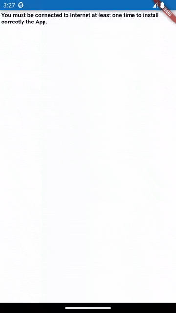

<head>
  <link rel="canonical" href="https://betterprogramming.pub/convert-a-pwa-into-a-flutter-app-using-webviews-387060548a37" />
</head>


In this article, we are going to convert a [PWA (Progressive Web App)](https://web.dev/progressive-web-apps/) into a Flutter Mobile App for Android and iOS using the latest version 6 of the [flutter_inappwebview](https://github.com/pichillilorenzo/flutter_inappwebview) plugin.

<!--truncate-->

### What are Progressive Web Apps?

Progressive Web App is a term that refers to web applications that are developed and loaded like regular web pages but which behave similarly to native applications when used on a mobile device.

They are built and enhanced with modern APIs to deliver enhanced capabilities, reliability, and installability while reaching anyone, anywhere, on any device with a single codebase. Progressive Web Applications leverage this dynamism of the new web along with technologies like service workers and manifest to offer a native app-like user experience that works even when the user is offline.

Developers can publish the web application online, ensure that it meets baseline installation requirements, and users can add the application to their home screen. Publishing the app to digital distribution systems like Apple App Store or Google Play is optional.

### What are Hybrid Apps?

Hybrid apps are applications that combine the features of both native apps and web apps. They run inside a container, in this case, a `WebView`.

They are available via app stores, can access native APIs and the hardware components of your phone, and are installed on your device, just like a native app.

I won't explain the pros and cons between PWAs, Native Apps, and Hybrid Apps because it's beyond the scope of this article. You can already search for it on the web.

### How To Convert a PWA to a Flutter App

As a PWA example, we will use [https://mdn.github.io/pwa-examples/js13kpwa/](https://mdn.github.io/pwa-examples/js13kpwa/) (GitHub repo: [js13kpwa](https://github.com/mdn/pwa-examples/blob/master/js13kpwa)), which is a fully functional PWA with offline support.

[js13kpwa](https://github.com/mdn/pwa-examples/blob/master/js13kpwa) is a list of A-Frame entries submitted to the js13kGames 2017 competition, used as an example for the MDN articles about Progressive Web Apps. The js13kPWA has the app shell structure, works offline with the service worker, is installable thanks to the manifest file and Add to Homescreen feature, and is re-engageable by using notifications and push.

Also, for this use case, we will add a simple two-way communication between JavaScript and Flutter/Dart.

#### Service workers

Service workers are a fundamental part of a PWA. They enable fast loading (regardless of the network), offline access, push notifications, and other capabilities.

Check [https://caniuse.com/serviceworkers](https://caniuse.com/serviceworkers) for JavaScript Service Worker API availability based on WebView/Browser version.

Service workers are available on Android starting from "Android 5-6.x WebView: Chromium 107" and on iOS starting from iOS 14.0+.

On iOS, enabling the Service Worker API requires additional setup using App-Bound Domains (read the [WebKit - App-Bound Domains](https://webkit.org/blog/10882/app-bound-domains/) article for more details).

The App-Bound Domains feature takes steps to preserve user privacy by limiting the domains on which an app can utilize powerful APIs to track users during in-app browsing.

You can specify up to ten "app-bound" domains using the `Info.plist` key `WKAppBoundDomains`.

So, we need to add the domain of our PWA to it. Otherwise, the Service Worker API will not work. For our use case, we need to add the `mdn.github.io` domain. Here is an example of the `ios/Runner/Info.plist` file:

```xml
<dict>  
  <!-- ... -->  
  <key>WKAppBoundDomains</key>  
  <array>  
    <string>mdn.github.io</string>  
  </array>  
  <!-- ... -->  
</dict>
```

#### Internet network detection

Detecting whether the user's mobile phone is connected to the internet is important for `WebView` to load the PWA from the cache instead of requesting the resources online.

To check if there is a valid connection, that is, cellular network or Wi-Fi, we will use the [connectivity_plus](https://pub.dev/packages/connectivity_plus) plugin. Instead, to test if the network is connected to internet, we can try to look up the address of a host, such as [https://example.com/](https://example.com/).

Here is the full code detection:

```dart
Future<bool> isNetworkAvailable() async {  
  // check if there is a valid network connection  
  final connectivityResult = await Connectivity().checkConnectivity();  
  if (connectivityResult != ConnectivityResult.mobile &&  
      connectivityResult != ConnectivityResult.wifi) {  
    return false;  
  }  
  
  // check if the network is really connected to Internet  
  try {  
    final result = await InternetAddress.lookup('example.com');  
    if (result.isEmpty || result[0].rawAddress.isEmpty) {  
      return false;  
    }  
  } on SocketException catch (_) {  
    return false;  
  }  
  
  return true;  
}
```

#### InAppWebView basic settings

To make the `InAppWebView` work correctly, we need to set some basic settings:

```dart
InAppWebViewSettings(  
    // enable opening windows support  
    supportMultipleWindows: true,  
    javaScriptCanOpenWindowsAutomatically: true,  
  
    // useful for identifying traffic, e.g. in Google Analytics.  
    applicationNameForUserAgent: 'My PWA App Name',  
    // Override the User Agent, otherwise some external APIs, such as Google and Facebook logins, will not work  
    // because they recognize the default WebView User Agent.  
    userAgent:  
        'Mozilla/5.0 (Linux; Android 13) AppleWebKit/537.36 (KHTML, like Gecko) Chrome/107.0.5304.105 Mobile Safari/537.36',  
  
    disableDefaultErrorPage: true,  
  
    // enable iOS service worker feature limited to defined App Bound Domains  
    limitsNavigationsToAppBoundDomains: true  
);
```

Change it depending on your needs.

In this example, we are enabling support for multiple windows in case we want to open popup `WebView` windows.

In some cases, you may also need to override the user agent to a different value from the default one to be able to use some external APIs, such as Google and Facebook logins. Otherwise, they will not work because they recognize and block the default `WebView` user agent.

Also, you must set the `limitsNavigationsToAppBoundDomains` setting to `true` enable Service Worker API on iOS.

#### HTTP (non-HTTPS) support

Starting with Android 9 (API level 28), cleartext support is disabled by default:

*   Check the official [Network security configuration - "Opt out of cleartext traffic"](https://developer.android.com/training/articles/security-config#CleartextTrafficPermitted) section.
*   Also, check this StackOverflow issue answer: [Cleartext HTTP traffic is not permitted](https://stackoverflow.com/a/50834600/4637638).

On iOS, you need to disable [Apple Transport Security](https://developer.apple.com/documentation/security/preventing_insecure_network_connections) (ATS) feature. There are two options:

*   Disable ATS for a specific domain only ([Official wiki](https://developer.apple.com/documentation/bundleresources/information_property_list/nsapptransportsecurity/nsexceptiondomains)): (add the following code to your `Info.plist` file)

```xml
<key>NSAppTransportSecurity</key>  
<dict>  
  <key>NSExceptionDomains</key>  
  <dict>  
    <key>www.yourserver.com</key>  
    <dict>  
      <!-- add this key to enable subdomains such as sub.yourserver.com -->  
      <key>NSIncludesSubdomains</key>  
      <true/>  
      <!-- add this key to allow standard HTTP requests, thus negating the ATS -->  
      <key>NSTemporaryExceptionAllowsInsecureHTTPLoads</key>  
      <true/>  
      <!-- add this key to specify the minimum TLS version to accept -->  
      <key>NSTemporaryExceptionMinimumTLSVersion</key>  
      <string>TLSv1.1</string>  
    </dict>  
  </dict>  
</dict>
```

*   Completely disable ATS ([Official wiki](https://developer.apple.com/documentation/bundleresources/information_property_list/nsapptransportsecurity/nsallowsarbitraryloads)). Add the following code to your `Info.plist` file:

<key>NSAppTransportSecurity</key>  
<dict>  
  <key>NSAllowsArbitraryLoads</key><true/>  
</dict>

Other useful `Info.plist` properties are:

*   `NSAllowsLocalNetworking`: A Boolean value indicating whether to allow loading of local resources ([Official wiki](https://developer.apple.com/documentation/bundleresources/information_property_list/nsapptransportsecurity/nsallowslocalnetworking))
*   `NSAllowsArbitraryLoadsInWebContent`: A Boolean value indicating whether all App Transport Security restrictions are disabled for requests made from web views ([Official wiki](https://developer.apple.com/documentation/bundleresources/information_property_list/nsapptransportsecurity/nsallowsarbitraryloadsinwebcontent))

### WidgetsBindingObserver

Also, we are going to use the `WidgetsBindingObserver` for Android, useful to know when the system puts the app in the background or returns the app to the foreground.

With it, we can stop and resume JavaScript execution and any processing that can be paused safely, such as videos, audio, and animations.

Here is a simple implementation of `didChangeAppLifecycleState`:

```dart
@override  
void didChangeAppLifecycleState(AppLifecycleState state) {  
  if (!kIsWeb) {  
    if (webViewController != null &&  
        defaultTargetPlatform == TargetPlatform.android) {  
      if (state == AppLifecycleState.paused) {  
        pauseAll();  
      } else {  
        resumeAll();  
      }  
    }  
  }  
}  
  
void pauseAll() {  
  if (defaultTargetPlatform == TargetPlatform.android) {  
    webViewController?.pause();  
  }  
  webViewController?.pauseTimers();  
}  
  
void resumeAll() {  
  if (defaultTargetPlatform == TargetPlatform.android) {  
    webViewController?.resume();  
  }  
  webViewController?.resumeTimers();  
}
```

### WillPopScope

To detect Android back button clicks, we wrap our main `Scaffold` widget app into a `WillPopScope` widget and implement the `onWillPop` method to go back in the history of `WebView`.

Here is an implementation example:

```dart
@override  
Widget build(BuildContext context) {  
  return WillPopScope(  
    onWillPop: () async {  
      // detect Android back button click  
      final controller = webViewController;  
      if (controller != null) {  
        if (await controller.canGoBack()) {  
          controller.goBack();  
          return false;  
        }  
      }  
      return true;  
    },  
    child: Scaffold(  
        appBar: AppBar(  
          // remove the toolbar  
          toolbarHeight: 0,  
        ),  
        body: // ...  
    ),  
  );  
}
```

### WebView PWA Wrapper

Before loading the PWA URL inside the `InAppWebView` wrapper, we check if the internet connection is available using the utility defined before, and, based on it, we need to set the cache mode and policy for Android and iOS this way:

```dart
// Android-only  
final cacheMode = networkAvailable  
    ? CacheMode.LOAD_DEFAULT  
    : CacheMode.LOAD_CACHE_ELSE_NETWORK;  
  
// iOS-only  
final cachePolicy = networkAvailable  
    ? URLRequestCachePolicy.USE_PROTOCOL_CACHE_POLICY  
    : URLRequestCachePolicy.RETURN_CACHE_DATA_ELSE_LOAD;
```

The `cacheMode` will be used in the `initialSettings` property and the `cachePolicy` will be used in the `URLRequest` of the `initialUrlRequest` property.

This logic allows us to load cached data if an unavailable internet connection.

To restrict navigation to the PWA host only, we implement the `shouldOverrideUrlLoading` method to check if a specific HTTP request for the main frame doesn't match the PWA host, so we will open that request in third-party apps using the [url_launcher](https://pub.dev/packages/url_launcher) plugin:

```dart
shouldOverrideUrlLoading:  
    (controller, navigationAction) async {  
  // restrict navigation to target host, open external links in 3rd party apps  
  final uri = navigationAction.request.url;  
  if (uri != null &&  
      navigationAction.isForMainFrame &&  
      uri.host != kPwaHost &&  
      await canLaunchUrl(uri)) {  
    launchUrl(uri);  
    return NavigationActionPolicy.CANCEL;  
  }  
  return NavigationActionPolicy.ALLOW;  
},
```

To detect if the PWA has been "installed" correctly the first time, we implement the `onLoadStop` `WebView` method to check the internet connection availability and if the PWA has already been installed:

```dart
onLoadStop: (controller, url) async {  
  if (await isNetworkAvailable() && !(await isPWAInstalled())) {  
    // if network is available and this is the first time  
    setPWAInstalled();  
  }  
},
```

The two utilities, `isPWAInstalled` and `setPWAInstalled`, could be implemented as follow using the [shared_preferences](https://pub.dev/packages/shared_preferences) plugin to get and save the PWA installation status:

```dart
Future<bool> isPWAInstalled() async {  
  final prefs = await SharedPreferences.getInstance();  
  return prefs.getBool('isInstalled') ?? false;  
}  
  
void setPWAInstalled({bool installed = true}) async {  
  final prefs = await SharedPreferences.getInstance();  
  await prefs.setBool('isInstalled', installed);  
}
```

All these utilities allow us to detect network availability and installation status of the PWA so that we can implement a custom error page, as below:

```dart
onReceivedError: (controller, request, error) async {  
  final isForMainFrame = request.isForMainFrame ?? true;  
  if (isForMainFrame && !(await isNetworkAvailable())) {  
    if (!(await isPWAInstalled())) {  
      await controller.loadData(  
          data: kHTMLErrorPageNotInstalled);  
    }  
  }  
},
```

where `kHTMLErrorPageNotInstalled` is a String containing our custom HTML.

If you need to support the [Web Notification JavaScript API](https://developer.mozilla.org/en-US/docs/Web/API/Notifications_API), unfortunately, Android-native WebView and iOS-native WKWebView don't support that feature natively, so we must implement it ourselves! For an example implementation, you can check the [Web Notification project example](https://github.com/pichillilorenzo/flutter_inappwebview_examples/tree/main/web_notification). It uses a [UserScript](https://inappwebview.dev/docs/webview/javascript/user-scripts) to inject custom JavaScript code at web page startup to implement the Web Notification API.

The injected JavaScript code tries to create a "polyfill" for the [Notification](https://developer.mozilla.org/en-US/docs/Web/API/Notification) window object and communicate with Flutter/Dart side using [JavaScript Handlers](https://inappwebview.dev/docs/webview/javascript/communication#JavaScript-Handlers) to manage and implement the corresponding Notification UI, for example, when you are requesting permission with [Notification.requestPermission()](https://developer.mozilla.org/en-US/docs/Web/API/Notification/requestPermission) or when you want to show a notification.

Also, if you need to support the usage of the camera and microphone (for example, a WebRTC App), you need to implement the `onPermissionRequest` event and ask for permissions using, for example, the [permission_handler](https://pub.dev/packages/permission_handler) plugin. For more details, visit the [official WebRTC guide](https://inappwebview.dev/docs/web-rtc) and the [WebRTC project example](https://github.com/pichillilorenzo/flutter_inappwebview_examples/tree/main/webrtc).

To manage requests that open a new window using JavaScript (`window.open()`) or by the target attribute in a link (such as `target="_blank"`), we must implement the `onCreateWindow` event and return `true` to declare that we are handling the request. Here is a simple example:

```dart
onCreateWindow: (controller, createWindowAction) async {  
  showDialog(  
    context: context,  
    builder: (context) {  
      final popupWebViewSettings =  
          sharedSettings.copy();  
      popupWebViewSettings.supportMultipleWindows =  
          false;  
      popupWebViewSettings  
              .javaScriptCanOpenWindowsAutomatically =  
          false;  
  
      return WebViewPopup(  
          createWindowAction: createWindowAction,  
          popupWebViewSettings: popupWebViewSettings);  
    },  
  );  
  return true;  
},
```

The `WebViewPopup` is another `InAppWebView` instance inside an `AlertDialog` widget that takes in input the `createWindowAction` to get the `windowId` to use for the new `WebView`. The `windowId` is an identifier used on the native side to get the right `WebView` reference that Flutter must show. The WebView Popup will also implement the `onCloseWindow` to listen when the popup should be closed and removed from the Widget tree:

```dart
onCloseWindow: (controller) {  
  Navigator.pop(context);  
},
```

Check also the [Popup Window project example](https://github.com/pichillilorenzo/flutter_inappwebview_examples/tree/main/popup_window) for an example implementation.

To implement our two-way communication between JavaScript and Flutter/Dart side, we will use the [JavaScript Handlers](https://inappwebview.dev/docs/webview/javascript/communication#JavaScript-Handlers) feature.

For our use case, we want listen for clicks on the "Request dummy notifications" button HTML element with id `notifications` and show a `SnackBar` with the random text generated by JavaScript.

To do that, we create a simple [User Script](https://inappwebview.dev/docs/webview/javascript/user-scripts) and inject it after the page is loaded:

```dart
initialUserScripts: UnmodifiableListView<UserScript>([  
  UserScript(  
      source: """  
      document.getElementById('notifications').addEventListener('click', function(event) {  
        var randomText = Math.random().toString(36).slice(2, 7);  
        window.flutter_inappwebview.callHandler('requestDummyNotification', randomText);  
      });  
      """,  
      injectionTime:  
          UserScriptInjectionTime.AT_DOCUMENT_END)  
]),
```

Then, we add the corresponding JavaScript Handler right after when the `WebView` instance is created:

```dart
onWebViewCreated: (controller) {  
  webViewController = controller;  
  
  controller.addJavaScriptHandler(  
    handlerName: 'requestDummyNotification',  
    callback: (arguments) {  
      final String randomText =  
          arguments.isNotEmpty ? arguments[0] : '';  
      ScaffoldMessenger.of(context).showSnackBar(  
          SnackBar(content: Text(randomText)));  
    },  
  );  
},
```

Here is the result:




The full code project example is available at [https://github.com/pichillilorenzo/flutter_inappwebview_examples/tree/main/pwa_to_flutter_app](https://github.com/pichillilorenzo/flutter_inappwebview_examples/tree/main/pwa_to_flutter_app)

That's all for today!

Are you using this plugin? Submit your app through the [Submit App](https://inappwebview.dev/submit-app/) page and follow the instructions. Check the [Showcase](https://inappwebview.dev/showcase/) page to see who is already using it!

_This project follows the_ [_all-contributors_](https://github.com/all-contributors/all-contributors) _specification (_[_contributors_](https://github.com/pichillilorenzo/flutter_inappwebview#contributors-)_). I want to thank all the people that are supporting the project in any way. Thanks a lot to all of you!_ 💙
