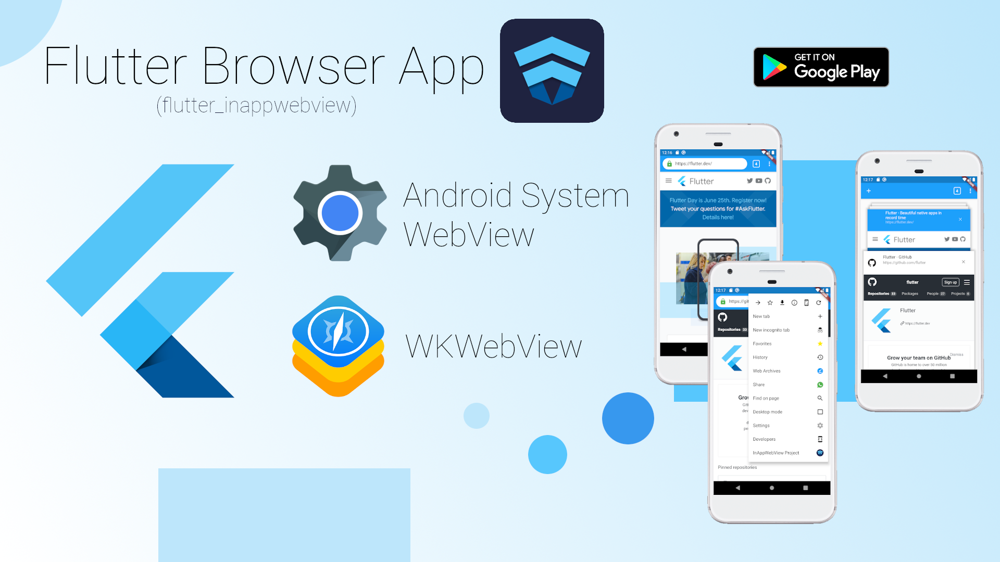
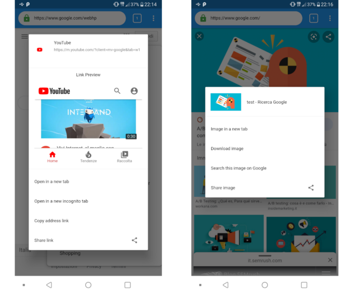
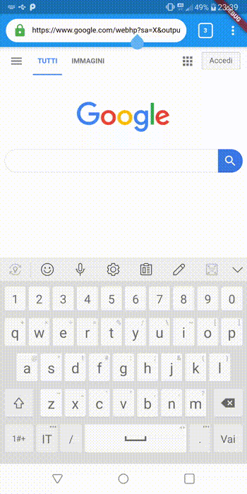
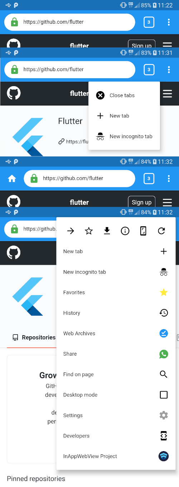
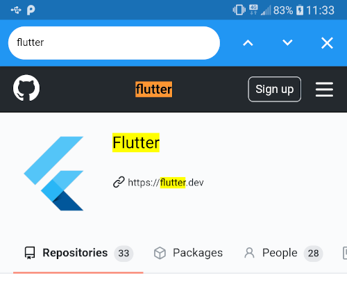
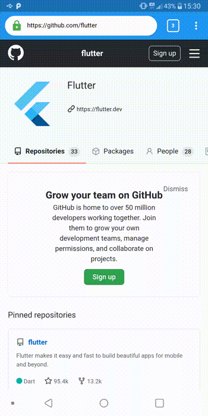

<head>
  <link rel="canonical" href="https://medium.com/flutter-community/inappwebview-the-real-power-of-webviews-in-flutter-c6d52374209d" />
</head>



In this article, I'm going to show how to create a full-featured mobile Browser App such as the [Google Chrome](https://play.google.com/store/apps/details?id=com.android.chrome&hl=en) mobile browser using the features offered by the [`flutter_inappwebview`](https://github.com/pichillilorenzo/flutter_inappwebview) plugin.

<!--truncate-->

Check out the previous article that introduces the **flutter_inappwebview** plugin here: **[InAppWebView: The Real Power of WebViews in Flutter](https://medium.com/flutter-community/inappwebview-the-real-power-of-webviews-in-flutter-c6d52374209d)**.

This is what we are going to implement:
- **WebView Tab**, with custom on long-press link/image preview, and how to move from one tab to another without losing the WebView state;
- **Browser App Bar** with the current URL and all popup menu actions such as opening a new tab, a new incognito tab, saving the current URL to the favorite list, saving a page to offline usage, viewing the SSL Certificate used by the website, enable Desktop Mode, etc. (features similar to the Google Chrome App);
- **Developer console**, where you can execute JavaScript code, see some network info, manage the browser storage such as cookies, window.localStorage , etc;
- **Settings page**, where you can update the browser general settings and [enable/disable all the features](https://github.com/pichillilorenzo/flutter_inappwebview#inappwebview-options) offered by the flutter_inappwebview for each WebView Tab, such as enabling/disabling JavaScript, caching, scrollbars, setting custom user-agent, etc., and all the Android and iOS-specific features;
- **Save** and **restore** the current Browser state.

Instead, about the app state management, we are going to use the [`provider`](https://pub.dev/packages/provider) package.

The two main models used to realize this Browser app are the `BrowserModel` and the `WebViewModel`, which contains info and data of the Browser, such as the list of all WebView tabs and the current WebView tab displayed. They will be used also to save and restore the Browser state. To save and restore these models, we are going to use the [`shared_preferences`](https://pub.dev/packages/shared_preferences) package.

Because the code could be very long, I'm going to show only little parts of the code or just pseudo-code. However, the **full code** is available on **Github** at https://github.com/pichillilorenzo/flutter_browser_app.

Also, this app is **available on the Google Play Store** at https://play.google.com/store/apps/details?id=com.pichillilorenzo.flutter_browser

This is the final result we are going to have: https://drive.google.com/file/d/1wE2yUGwjNBiUy72GOjPIYyDXYQn3ewYn/view?usp=sharing

## WebView Tab

The first thing we are going to implement is the WebView Tab. Considering that we need to maintain the state of each WebView Tab and the ability to move from one to another, we could use the `IndexedStack` widget, where the `index` property is the current WebView Tab we want to show and `children` is the list of all WebView Tab opened in the Browser.

We also want to show a progress bar that indicates the current load progress of the WebView, so we use the `Stack` widget where the first child is the `IndexedStack` widget created before and the second one is a `LinearProgressIndicator`. We can image this to be something like this:
```dart
var stackChildren = <Widget>[
  IndexedStack(
    index: browserModel.getCurrentTabIndex(),
    children: browserModel.webViewTabs,
  ),
  LinearProgressIndicator()
];

return Stack(
  children: stackChildren,
);
```

Each WebView Tab will be an instance of our custom `WebViewTab` widget, that is a `StatefulWidget` containing the `InAppWebView` instance (the real WeView), and the `InAppWebViewController` to control it. Each WebView Tab will have its `GlobalKey` to be distinguishable from the other browser tabs and a `WebViewModel` instance that contains the necessary data, such as the current URL and its WebView settings, to be able to restore them when the App is completely closed and reopened by the user.

For each WebView, the most important data we want to save is the current URL (also when it updates!), the page title, if it is secure or not, its favicon, its tab index, and its settings.

To track URL changes, we use the `onLoadStart`, `onLoadStop` and `onUpdateVisitedHistory` events. To listen to the website progress change, we use the `onProgressChanged` event. When the website is loaded, we use `onLoadStop` to get the website title, its favicon and we check if it is secure or not, based on the **HTTPS protocol**, the presence of an **SSL certificate** (**X509Certificate**), and any **SSL errors**.

Also, we want to implement our custom link/image preview. To do that, we use the `onLongPressHitTestResult` event, that detects the long-press event of the user inside the WebView. It returns a `hitTestResult` that contains useful information about what the user clicked, for example, if it is an image or a link. We check that and we show our custom `AlertDialog`:



On the left, we have a long-press link preview. Instead, on the right, we have detected that it is an image, so we show the corresponding alert dialog.

Also, we want to **pause**/**resume** the WebView when the App is paused/resumed and pause/resume JavaScript execution when we move from one WebView Tab to another.

To pause/resume WebView on Android, we can use `InAppWebViewController.android.pause()` and `InAppWebViewController.android.resume()` methods (on iOS, it is automatically managed by the `WKWebView` itself). Instead, to pause/resume JavaScript execution, we can use the `InAppWebViewController.pauseTimers()` and `InAppWebViewController.resumeTimers()` methods.

:::info
On Android, calling pause/resume timer methods will pause/resume JavaScript execution for all WebViews, instead, on iOS, it will pause/resume only for the specific WebView.
:::

These methods will be called when the App Lifecycle State changes, that is when the `didChangeAppLifecycleState` event is fired by Flutter:
```dart
@override
void didChangeAppLifecycleState(AppLifecycleState state) {
  if (_webViewController != null) {
    if (state == AppLifecycleState.paused) {
      if (Platform.isAndroid) {
        _webViewController?.android?.pause();
      }
      _webViewController?.pauseTimers();
    } else {
      if (Platform.isAndroid) {
        if (Platform.isAndroid) {
          _webViewController?.android?.resume();
        }
        _webViewController?.resumeTimers();
      } else if (Platform.isIOS) {
        var currentWebViewModel =
          Provider.of<WebViewModel>(context, listen: false);
        if (widget.webViewModel.tabIndex ==
          currentWebViewModel.tabIndex) {
          _webViewController?.resumeTimers();
        } else {
          _webViewController?.pauseTimers();
        }
      }
    }
  }
}
```

Furthermore, we want to show a custom error page when there is a load error. For that case, we can listen to the `onLoadError` event and, for example, load a custom HTML into the WebView (or whatever you want):
```dart
onLoadError: (controller, url, code, message) async {
  if (Platform.isIOS && code == -999) {
    // NSURLErrorDomain
    return;
  }

  url = url ?? 'about:blank';

  _webViewController?.loadData(data: """
<!DOCTYPE html>
<html lang="en">
<head>
    <meta charset="UTF-8">
    <meta name="viewport" content="width=device-width, user-scalable=no, initial-scale=1.0, maximum-scale=1.0, minimum-scale=1.0">
    <meta http-equiv="X-UA-Compatible" content="ie=edge">
    <style>
    ${await _webViewController?.getTRexRunnerCss()}
    </style>
    <style>
    .interstitial-wrapper {
        box-sizing: border-box;
        font-size: 1em;
        line-height: 1.6em;
        margin: 0 auto 0;
        max-width: 600px;
        width: 100%;
    }
    </style>
</head>
<body>
    ${await _webViewController?.getTRexRunnerHtml()}
    <div class="interstitial-wrapper">
      <h1>Website not available</h1>
      <p>Could not load web pages at <strong>$url</strong> because:</p>
      <p>$message</p>
    </div>
</body>
    """, baseUrl: url, androidHistoryUrl: url);
},
```

On Android, we can also disable the default error page using the Android-specific option `disableDefaultErrorPage: true`. This is the result:



Yes! You are right! It is the T-Rex Runner game! 🦖🦖🦖

## Browser App Bar

The Browser App Bar and its actions are based on the Google Chrome mobile app. As you can see, it is composed of a search bar, a rectangle showing the number of tabs, and a dropdown menu.

It is an instance of `AppBar` where:
- if the Home Page option is enabled, the leading item is an `IconButton`;
- the title item is a `Stack` widget composed of a simple `TextField` that listen to the `onSubmitted` event, and an `IconButton` that indicates if the current Website is secure or not or if it is an offline website (a web archive);
- the action items are an `InkWell` widget, that contains the number of current tabs and provides access to move to another tab or close them, and a `PopupMenuButton` widget, that contains the list of all available action, such as "New Tab", "New Incognito Tab", "Settings" page, "Developers" page, etc.



As you can see, dropdown actions are similar to the Google Chrome mobile app: we can move through the WebView history, save the current page as a web archive, save the website to the favorite list, enable desktop mode, reloading the page, taking a screenshot, etc.

The `BrowserModel` contains the favorite list, which is a simple list of `FavoriteModel` instances, which contains the favicon, URL, and title of each webpage saved as a favorite. The `BrowserModel` contains also a `Map<String, WebArchiveModel>` that represents the Web Archives saved using the `InAppWebViewController.android.saveWebArchive` method (at this moment, this method is available only on Android) to download the webpages in order to use them offline.

Instead, the WebView Tab history is provided by the `InAppWebViewController.getCopyBackForwardList` method, which returns the list of visited URLs and titles during the current session.

If we click on the "Find on page" action, the Browser App Bar will show the corresponding `AppBar` widget which manages the "Find on" WebView feature through a `TextField` widget and 3 IconButtons as actions, allowing us to search words using the `InAppWebViewController.findAllAsync(find: "")` method, moving from one result to another using the `InAppWebViewController.findNext(forward: )` method, and clear the matches found using the `InAppWebViewController.clearMatches` method.



So, the Browser App Bar will be a Widget that implements `PreferredSizeWidget`:
```dart
class BrowserAppBar extends StatefulWidget
    implements PreferredSizeWidget {
  BrowserAppBar({Key key})
      : preferredSize = Size.fromHeight(kToolbarHeight),
        super(key: key);

  @override
  _BrowserAppBarState createState() => _BrowserAppBarState();

  @override
  final Size preferredSize;
}

class _BrowserAppBarState extends State<BrowserAppBar> {
  bool _isFindingOnPage = false;

  @override
  Widget build(BuildContext context) {
    return _isFindingOnPage
        ? FindOnPageAppBar(
            hideFindOnPage: () {
              setState(() {
                _isFindingOnPage = false;
              });
            },
          )
        : WebViewTabAppBar(
            showFindOnPage: () {
              setState(() {
                _isFindingOnPage = true;
              });
            },
          );
  }
}
```

where `FindOnPageAppBar` and `WebViewTabAppBar` are `AppBar` instances.

### SSL Certificate Viewer



As you can see, on the left side of the website URL there will be a green lock icon if the current website is using a valid SSL Certificate (we check it through `onReceivedServerTrustAuthRequest` WebView event) or if it is local content, otherwise, a grey outline info icon will be shown.

If you click on it, the app shows a custom popup dialog, implemented using a custom `PageRoute` class in order to allow us to create a new page route with transparent background.

If you click on "Details" and then on "Certificate info", you can see an `AlertDialog` widget with all the X509 Certificate details.

### Move from one WebView Tab to another

Because we have the list of all WebView Tab saved in our `BrowserModel` and each WebView Tab has its `GlobalKey`, we can change the displayed WebView updating the current WebView Tab index with the one we want to display.

We can achieve this in multiple ways, for example using a simple `ListView` where each child shows the WebView Tab title, favicon and URL, and, when a user clicks on it, we update the current WebView Tab index of our `BrowserModel` instance with the index of the child clicked.

In this sample App, I implemented it using a custom widget called `TabViewer` that uses a `GestureDetector` widget to listen to vertical drag events in order to mimic the behavior of the Google Chrome mobile app. Using the `Timer` class and the `Transform` widget, I obtained this effect:


## Developer Console

The Developer Console page contains a `TabBarView` with 3 tabs:
- JavaScript Console: where you can see console logs and execute JavaScript code as if you were on the JavaScript Console of the Google Chrome desktop version;
- Network Info: where you can see all the resources loaded for the main frame, such as images, XMLHttpRequests, etc;
- Storage Manager: where you can manage cookies, web storage, and HTTP auth credentials.

To listen to JavaScript console logs, we use the `onConsoleMessage` WebView event on our WebView Tab, instead, to execute JavaScript code, we use the `InAppWebViewController.evaluateJavascript(source: "")` method.


Each console log message and JavaScript result will be added to the list displayed in the JavaScript Console Tab. Also, we can move through our JavaScript code history and clear the current list.

To listen to the resources loading, we use the `onLoadResource` WebView event on our WebView Tab. Each resource will be added to the list displayed in the Network Info Tab.

Instead, the Storage Manager Tab will use the `CookieManager` class to manages cookies, `InAppWebViewController.webStorage` to manage local and session storage, `HttpAuthCredentialDatabase` to manage HTTP Auth credentials, and `WebStorageManager` that manages web storage in general, such as the Application Cache API, the Web SQL Database API, and the HTML5 Web Storage API (on Android it is implemented using [WebStorage](https://developer.android.com/reference/android/webkit/WebStorage.html), instead, on iOS it is implemented using [WKWebsiteDataStore.default()](https://developer.apple.com/documentation/webkit/wkwebsitedatastore)).

## Settings Page


This page contains all the Browser settings and also the current WebView Tab settings. It also contains a `TabBarView` with 3 tabs:
- Cross-platform options, such as the User-Agent, enable/disable JavaScript, enable/disable zoom support, etc.;
- Android-specific options, such as enable/disable DOM Storage API and Database storage API, cache mode, etc.;
- iOS-specific options, such as enable/disable over scroll, native link preview, etc.

Each tab contains a ListView widget where each child could be a `ListTile` widget, a `SwitchListTile` widget or a `Container` with a `DropdownButton` widget that represents a WebView option with a little description.

## Save and Restore the Browser state

As said before, to save and restore the Browser state, such as the current list of the WebView Tabs, we are going to use the [`shared_preferences`](https://pub.dev/packages/shared_preferences) package.

Each time the App recognizes that something is changed in the `BrowserModel` and in the current `WebViewModel` (such as the current URL or the title) using the `addListener` method provided by the `ChangeNotifier` class, we encode the `BrowserModel` instance into a JSON string and we save it using the [`shared_preferences`](https://pub.dev/packages/shared_preferences) package.

To avoid saving on quick sequential changes, we don't save it immediately, but we wait to check if during a certain range of time another "save" request has been made. Then, we save it.

When we restore the Browser state during the App restart, we decode the JSON string and we add/override all the necessary data into the current `BrowserModel` instance.

We can achieve this using the following 3 methods (save, flush, and restore) defined inside the `BrowserModel` class:
```dart
DateTime _lastTrySave = DateTime.now();
Timer _timerSave;
Future<void> save() async {
  _timerSave?.cancel();

  if (DateTime.now().difference(_lastTrySave) >= Duration(milliseconds: 400)) {
    _lastTrySave = DateTime.now();
    await flush();
  } else {
    _lastTrySave = DateTime.now();
    _timerSave = Timer(Duration(milliseconds: 500), () {
      save();
    });
  }
}

Future<void> flush() async {
  SharedPreferences prefs = await SharedPreferences.getInstance();
  await prefs.setString("browser", json.encode(toJson()));
}

Future<void> restore() async {
  SharedPreferences prefs = await SharedPreferences.getInstance();
  Map<String, dynamic> browserData;
  try {
    browserData = await json.decode(prefs.getString("browser"));
  } catch (e) {
    print(e);
    return;
  }

  this.clearFavorites();
  this.closeAllTabs();
  this.clearWebArchives();

  List<Map<String, dynamic>> favoritesList = browserData["favorites"]?.cast<Map<String, dynamic>>();
  List<FavoriteModel> favorites = favoritesList?.map((e) => FavoriteModel.fromMap(e))?.toList() ?? [];

  Map<String, dynamic> webArchivesMap = browserData["webArchives"]?.cast<String, dynamic>() ?? {};
  Map<String, WebArchiveModel> webArchives = webArchivesMap.map((key, value) =>
      MapEntry(key, WebArchiveModel.fromMap(value?.cast<String, dynamic>())));

  BrowserSettings settings = BrowserSettings.fromMap(browserData["settings"]?.cast<String, dynamic>()) ?? BrowserSettings();
  List<Map<String, dynamic>> webViewTabList = browserData["webViewTabs"]?.cast<Map<String, dynamic>>();
  List<WebViewTab> webViewTabs = webViewTabList
      ?.map((e) => WebViewTab(
        key: GlobalKey(),
        webViewModel: WebViewModel.fromMap(e),
      ))
      ?.toList() ?? [];
  webViewTabs.sort((a, b) => a.webViewModel.tabIndex.compareTo(b.webViewModel.tabIndex));


  this.addFavorites(favorites);
  this.addWebArchives(webArchives);
  this.updateSettings(settings);
  this.addTabs(webViewTabs);

  int currentTabIndex = browserData["currentTabIndex"] ?? this._currentTabIndex;
  currentTabIndex = min(currentTabIndex, this._webViewTabs.length - 1);

  if (currentTabIndex >= 0)
    this.showTab(currentTabIndex);
}
```

## Conclusion

In this article, we used the [`flutter_inappwebview`](https://github.com/pichillilorenzo/flutter_inappwebview) plugin to create a **Full-Featured Browser App**. The plugin is in continuous development (at the time of this writing, the latest release is `4.0.0+4`) and I recommend you check out the [API Reference](https://pub.dev/documentation/flutter_inappwebview/latest/) to find out all the features and the previous article that introduces the **flutter_inappwebview** plugin here: [**InAppWebView: The Real Power of WebViews in Flutter**](https://medium.com/flutter-community/inappwebview-the-real-power-of-webviews-in-flutter-c6d52374209d). For any new feature request/bug fix, you can use the issue section of the repository.

If you found this useful and you like the [`flutter_inappwebview`](https://github.com/pichillilorenzo/flutter_inappwebview) plugin and this App project, give a star to:
- Flutter plugin: https://github.com/pichillilorenzo/flutter_inappwebview
- Browser App: https://github.com/pichillilorenzo/flutter_browser_app (**Google Play Store link**: https://play.google.com/store/apps/details?id=com.pichillilorenzo.flutter_browser)

That's all for today, thanks for your attention!
