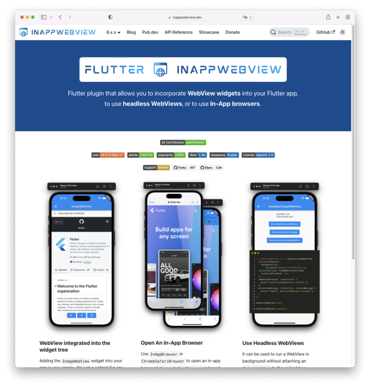
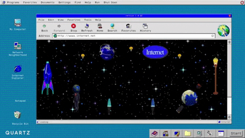
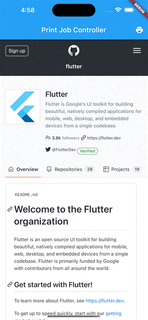

<head>
  <link rel="canonical" href="https://medium.com/@pichillilorenzo/flutter-inappwebview-6-b0bcef5ca3cf" />
</head>

[Flutter InAppWebView 6](https://github.com/pichillilorenzo/flutter_inappwebview) is out right now with a lot of new cool features and a fresh [new website](https://inappwebview.dev/) built using [Docusaurus 2.0](https://docusaurus.io/)! 🎉



Let’s start diving into it!

<!--truncate-->

## Migrating from version 5.x.x
Version 6.x.x now requires the minimum Flutter version to be `3.0.0`, Android `minSdkVersion` to be `19` (`android/app/build.gradle`), and the minimum iOS version to be `9.0` (`ios/Podfile`) with XCode version `>= 14`.

Check the online [Migration guide](https://inappwebview.dev/docs/migration-guide) for more details.

## Codebase refactoring
There was a huge codebase refactoring, on both dart and native sides, to be able to implement and support other features and platform implementations.

This will help a lot when Desktop support will be available.

## Web Support

This new version, finally, adds Web platform support!



The implementation uses the [iframe](https://developer.mozilla.org/en-US/docs/Web/HTML/Element/iframe) HTML element under the hood, so it comes with a lot of [restrictions and limitations](https://developer.mozilla.org/en-US/docs/Web/Security/Same-origin_policy#cross-origin_script_api_access) regarding JavaScript execution and feature implementations.

So, unfortunately, most of the implemented WebView controllers methods require the iframe to have the same origin as the website, otherwise, they won’t work!

To correctly setup the Web platform, you need to add the `web_support.js` file inside the `<head>` of your `web/index.html` file:

```html
<head>
  <!-- ... -->
    <script type="application/javascript" src="/assets/packages/flutter_inappwebview/assets/web/web_support.js" defer></script>
  <!-- ... -->
</head>
```

To enable WebRTC, you need to set the Web-specific setting `iframeAllow` to `camera; microphone`, for example:

```dart
initialSettings: InAppWebViewSettings(
 iframeAllow: "camera; microphone", // for camera and microphone permissions
 iframeAllowFullscreen: true, // if you need fullscreen support
),
```

Check more on [Getting Started — Setup Web](https://inappwebview.dev/docs/intro#setup-web).

## MacOS Support

Also, this version adds MacOS platform support!

The current MacOS WebView implementations are the `InAppBrowser` and `HeadlessWebView` classes.

To be able to make HTTP requests, you need to configure the macOS App Sandbox by enabling the `Outgoing Connections (Client)` option in your MacOS XCode Project, under `Runner > Signing & Capabilities`.

To customize the `InAppBrowser` instance, use the settings in `InAppBrowserSettings`, such as `windowType`, `windowAlphaValue`, `windowStyleMask`, `windowTitlebarSeparatorStyle`, `windowFrame`.

Here is an example of the `InAppBrowser` implementation:


Check more on [Getting Started — Setup MacOS](https://inappwebview.dev/docs/intro/#setup-macos).

To track general Desktop support, check [#460](https://github.com/pichillilorenzo/flutter_inappwebview/issues/460).

## New cool features

As you can see from the [CHANGELOG](https://github.com/pichillilorenzo/flutter_inappwebview/blob/master/CHANGELOG.md), there are so many new features!


Let’s just see some of these below.

### Debugging info

WebViews and some controllers have debugging info enabled by default when your flutter app is running in debug mode (based on the `kDebugMode` flutter constant value).

For example, while an `InAppWebView` or `HeadlessInAppWebView` is running, you will see debugging info in your IDE log console with details of the various fired WebView events.

Through the `WebView.debugLoggingSettings` static property, you can change the `DebugLoggingSettings` values.

If you want to disable WebView debugging info, simply set the `WebView.debugLoggingSettings.enabled` to `false`.

Check more on [Debugging WebViews](https://inappwebview.dev/docs/debugging-webviews/).

### Proxy Controller for Android

`ProxyController` represents the proxy settings that govern network requests made by `WebView`. It's available only on Android!

This API may be used to explicitly specify the proxy rules that govern WebView-initiated network requests.

Check more on [Proxy Controller](https://inappwebview.dev/docs/webview/proxy-controller).

### Print Job Controller

PrintJobController represents the controller used by the `WebView` to manage print jobs.

A `PrintJobController` is returned by the `InAppWebViewController.printCurrentPage(PrintJobSettings? settings)` method or as an argument when the `onPrintRequest` event is fired.

To obtain the instance when using the `printCurrentPage` method, set `PrintJobSettings.handledByClient` to `true`.

With `PrintJobSettings` you can set various print settings (some are platform-specific!), such as the color and orientation print mode.

Here is an example:

```dart
final jobSettings = PrintJobSettings(
  handledByClient: true,
  jobName: (await webViewController.getTitle() ?? ‘’) +
    “ — PDF Document example”,
  colorMode: PrintJobColorMode.MONOCHROME,
  outputType: PrintJobOutputType.GRAYSCALE,
  orientation: PrintJobOrientation.LANDSCAPE,
  numberOfPages: 1);
final printJobController = await webViewController
  .printCurrentPage(settings: jobSettings);
```



Check more on [Print Job Controller](https://inappwebview.dev/docs/webview/print-job-controller).

### Find Interaction Controller

`FindInteractionController` represents the controller used by the `WebView` to add text-finding capabilities, such as the "Find on page" feature.

Before it, you could use the `InAppWebViewController.findAllAsync` and `InAppWebViewController.findNext` methods and listen for the `WebView.onFindResultReceived` event, that are now deprecated!

With this controller, now you have more fine-grain control over the search feature. On iOS, if the `InAppWebViewSettings.isFindInteractionEnabled` setting is `true`, it will use the web view’s built-in find interaction native UI!


Check more on [Find Interaction Controller](https://inappwebview.dev/docs/webview/find-interaction-controller/).

### WebView onPermissionRequest event on iOS 15.0+

The `onPermissionRequest` event is now supported also on iOS 15.0+, which you can use, as you already do on Android, to grant or deny permission about the camera, microphone, and device orientation/motion.

Example:

```dart
onPermissionRequest: (controller, request) async {
  return PermissionResponse(
      resources: request.resources,
      action: PermissionResponseAction.GRANT);
},
```

## Conclusion

That’s all for today!

If this project helps you in any way, please consider [making a donation](https://inappwebview.dev/donate)!

Are you using this plugin? Submit your app through the [Submit App](https://inappwebview.dev/submit-app/) page and follow the instructions.
Check the [Showcase](https://inappwebview.dev/showcase/) page to see who is already using it!

This project follows the [all-contributors](https://github.com/all-contributors/all-contributors) specification ([contributors](https://github.com/pichillilorenzo/flutter_inappwebview#contributors-)). I want to thank all the people that are supporting the project in any way. Thanks a lot to all of you! 💙
