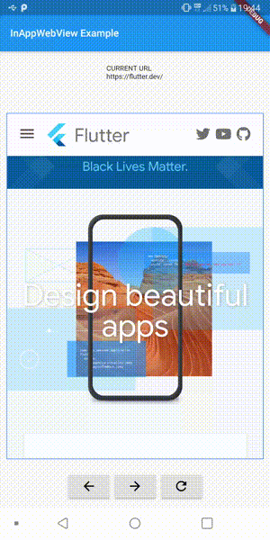
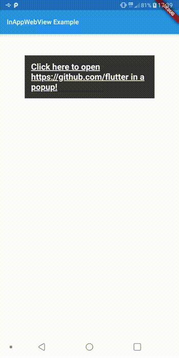
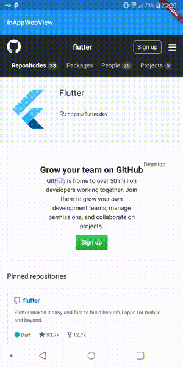

<head>
  <link rel="canonical" href="https://medium.com/flutter-community/inappwebview-the-real-power-of-webviews-in-flutter-c6d52374209d" />
</head>

import Gist from 'super-react-gist';


What is [`flutter_inappwebview`](https://github.com/pichillilorenzo/flutter_inappwebview)? It's a Flutter plugin that allows you to incorporate **WebView widgets** into your Flutter app, to use **headless WebViews**, or to use **In-App browsers**.

So, what's the difference between [`webview_flutter`](https://pub.dev/packages/webview_flutter) (Official flutter plugin) or [`flutter_webview_plugin`](https://pub.dev/packages/flutter_webview_plugin)?

<!--truncate-->

Compared to all other WebView plugins, it is **feature-rich**: a lot of **events**, **methods**, and **options** to control WebViews. Furthermore, they do not have good documentation about their API or, at least, it is not complete. Instead, every feature of flutter_inappwebview is almost all documented (just check the [API Reference on pub.dev](https://pub.dev/documentation/flutter_inappwebview/latest/index.html)).

In this article, I'm going to present the main classes and some examples of the `InAppWebView` widget that people were asking about on the official [flutter_inappwebview repository](https://github.com/pichillilorenzo/flutter_inappwebview) (issue section) and on StackOverflow.

## Main Classes Overview
This is a list of the main classes that the plugin offers:
- [InAppWebView](https://github.com/pichillilorenzo/flutter_inappwebview#inappwebview-class): Flutter Widget for adding an **inline native WebView** integrated into the flutter widget tree.
- [ContextMenu](https://github.com/pichillilorenzo/flutter_inappwebview#contextmenu-class): This class represents the WebView context menu.
- [HeadlessInAppWebView](https://github.com/pichillilorenzo/flutter_inappwebview#headlessinappwebview-class): Class that represents a WebView in headless mode. It can be used to run a WebView in background without attaching an `InAppWebView` to the widget tree.
- [InAppBrowser](https://github.com/pichillilorenzo/flutter_inappwebview#inappbrowser-class): In-App Browser using native WebView.
- [ChromeSafariBrowser](https://github.com/pichillilorenzo/flutter_inappwebview#chromesafaribrowser-class): In-App Browser using [Chrome Custom Tabs](https://developer.android.com/reference/android/support/customtabs/package-summary) on Android / [SFSafariViewController](https://developer.apple.com/documentation/safariservices/sfsafariviewcontroller) on iOS.
- [InAppLocalhostServer](https://github.com/pichillilorenzo/flutter_inappwebview#inapplocalhostserver-class): This class allows you to create a simple server on `http://localhost:[port]/`. The default `port` value is `8080`.
- [CookieManager](https://github.com/pichillilorenzo/flutter_inappwebview#cookiemanager-class): This class implements a singleton object (shared instance) that manages the cookies used by WebView instances.
- [HttpAuthCredentialDatabase](https://github.com/pichillilorenzo/flutter_inappwebview#httpauthcredentialdatabase-class): This class implements a singleton object (shared instance) which manages the shared HTTP auth credentials cache.
- [WebStorageManager](https://github.com/pichillilorenzo/flutter_inappwebview#webstoragemanager-class): This class implements a singleton object (shared instance) which manages the web storage used by WebView instances.

In this article, I'm going to show in particular the `InAppWebView` widget, that is the most used/requested one.

### InAppWebView Widget

Adding the `InAppWebView` widget into your app is very simple. It's just a widget like any other Flutter widget: `InAppWebView(initialUrl: 'https://github.com/flutter')`.

**NOTE**: To use it on iOS, you need to opt-in for the embedded views preview by adding a boolean property to the app's `Info.plist` file, with the key `io.flutter.embedded_views_preview` and the value `YES`.

This widget has a set of initial attributes that you can use to initialize the WebView:
- **initialUrl**: Initial URL that will be loaded.
- **initialOptions**: Initial WebView options that will be used.
- **gestureRecognizers**: specifies which gestures should be consumed by the WebView;
- **initialData**: Initial InAppWebViewInitialData that will be loaded, such as an HTML string.
- **initialFile**: Initial asset file that will be loaded (check the "[_Load a file inside assets folder_](https://github.com/pichillilorenzo/flutter_inappwebview#load-a-file-inside-assets-folder)" Section).
- **initialHeaders**: Initial headers that will be used.
- **contextMenu**: Context menu which contains custom menu items.

The list of all available WebView options is quite long, for example, you can enable/disable JavaScript using the javascriptEnabled option or enable/disable cache using the cacheEnabled option. The full list of all options is available [**here**](https://github.com/pichillilorenzo/flutter_inappwebview#inappwebview-options).

### Use InAppWebViewController to control your WebView

Instead, to control the WebView, you have the `InAppWebViewController` class. This controller is returned by the `onWebViewCreated` callback when the WebView is ready to be used.
Through it, you can control your WebView or access its properties, such as the current URL using `getUrl` method. Other methods, for example, are `loadUrl` to load a new URL, `postUrl` to load a given URL with custom data using POST method, `evaluateJavascript` to evaluate JavaScript code into the WebView, and to get the result of the evaluation, `takeScreenshot` to take the screenshot (in PNG format) of the WebView's visible viewport, `getCertificate` to get the **SSL certificate** for the main top-level page or `null` if there is no certificate. The full list of all methods you can use is quite long and available [**here**](https://github.com/pichillilorenzo/flutter_inappwebview#inappwebviewcontroller-methods).

### InAppWebView Events

The InAppWebView widget offers a variety of events! Here's a few of them:
- **onLoadStart**: event fired when the WebView starts to load an URL;
- **onLoadStop**: event fired when the WebView finishes loading an URL;
- **onLoadHttpError**: event fired when the WebView main page receives an HTTP error;
- **onConsoleMessage**: event fired when the WebView receives a JavaScript console message (such as `console.log`, `console.error`, etc.);
- **shouldOverrideUrlLoading**: gives the host application a chance to take control when a URL is about to be loaded in the current WebView;
- **onDownloadStart**: event fired when WebView recognizes a downloadable file;
- **onReceivedHttpAuthRequest**: event fired when the WebView received an HTTP authentication request. The default behavior is to cancel the request;
- **onReceivedServerTrustAuthRequest**: event fired when the WebView need to perform server trust authentication (certificate validation);
- **onPrint**: event fired when `window.print()` is called from JavaScript side;
- **onCreateWindow**: event fired when the InAppWebView requests the host application to create a new window, for example when trying to open a link with `target="_blank"` or when `window.open()` is called by JavaScript side;

and **many many more**! I recommend checking the API Reference to get more details. As for the WebView options and methods, the full list of all WebView events is quite long and available [**here**](https://github.com/pichillilorenzo/flutter_inappwebview#inappwebview-events).

### InAppWebView Simple Example

Here is a simple example that shows an `InAppWebView` widget, its current URL, and 3 buttons: one to go back, one to go forward, and another one to reload the current page.



This is the full code example:

<Gist url="https://gist.github.com/pichillilorenzo/44f4f8921754d046dfbda982f2e681b7"/>

### JavaScript Handlers (Channels)

You can communicate with the JavaScript side and vice-versa. To add a JavaScript handler, you can use `_webViewController.addJavaScriptHandler` method, where you define the `handlerName` and a `callback` to be invoked when it is called by the JavaScript side. The `callback` can return data to be sent on the JavaScript side.

Instead, on the JavaScript side, to execute the callback handler and send data to Flutter, you need to use `window.flutter_inappwebview.callHandler(handlerName <String>, ...args)` method, where `handlerName` is a string that represents the handler name that your calling and `args` are optional arguments that you can send to the Flutter side.

In order to call `window.flutter_inappwebview.callHandler(handlerName <String>, ...args)` properly, you need to wait and listen to the JavaScript event `flutterInAppWebViewPlatformReady`. This event will be dispatched as soon as the platform (Android or iOS) is ready to handle the `callHandler` method.

Here is an example:

<Gist url="https://gist.github.com/pichillilorenzo/ec214383d3458072a2702a901e13dd8f"/>

### WebRTC in InAppWebView

At this moment, **WebRTC** is supported only on Android, because, unfortunately, on iOS `WKWebView` doesn't implement all the WebRTC API (you can follow this issue: [**#200**](https://github.com/pichillilorenzo/flutter_inappwebview/issues/200)).

I'm going to show an example using https://appr.tc/ to test WebRTC feature. It's a video chat demo app based on WebRTC (https://github.com/webrtc/apprtc).

To request permissions about the camera and microphone, you can use the [permission_handler](https://pub.dev/packages/permission_handler) plugin. Also, you need to set the WebView option `mediaPlaybackRequiresUserGesture` to `false` in order to autoplay HTML5 audio and video.

Furthermore, on Android, you need to implement the `androidOnPermissionRequest` event (it's an Android-specific event), that is an event fired when the WebView is requesting permission to access a specific resource (that is the Android native [WebChromeClient.onPermissionRequest event](https://developer.android.com/reference/android/webkit/WebChromeClient#onPermissionRequest(android.webkit.PermissionRequest))). In this case, this event is used to grant permissions for the WebRTC API. Also, you need to add these permissions in the `AndroidManifest.xml`:
```xml
<uses-permission android:name="android.permission.INTERNET"/>
<uses-permission android:name="android.permission.CAMERA" />
<uses-permission android:name="android.permission.RECORD_AUDIO" />
<uses-permission android:name="android.permission.MODIFY_AUDIO_SETTINGS" />
<uses-permission android:name="android.permission.VIDEO_CAPTURE" />
<uses-permission android:name="android.permission.AUDIO_CAPTURE" />
```


Here is the full code example:

<Gist url="https://gist.github.com/pichillilorenzo/6608a42e28d9aea5447cd66a1c697965" />

### How to enable download files in InAppWebView

`InAppWebView` can recognize downloadable files in both Android and iOS platforms. To be able to recognize downloadable files, you need to set the `useOnDownloadStart: true` option, and then you can listen to the `onDownloadStart` event.

On Android you need to add write permission inside your `AndroidManifest.xml` file:
```xml
<uses-permission android:name="android.permission.WRITE_EXTERNAL_STORAGE" />
```
Then, you need to ask permission using the [permission_handler](https://pub.dev/packages/permission_handler) plugin. Instead, to effectively download your file, you can use the [flutter_downloader](https://pub.dev/packages/flutter_downloader) plugin.
Here is a complete example using http://ovh.net/files/ (in particular, the http://ovh.net/files/1Mio.dat as URL) to test the download:

<Gist url="https://gist.github.com/pichillilorenzo/ee74e103fdc324f761c5fde7b73bd430" />

As you can see, I'm using also the [path_provider](https://pub.dev/packages/path_provider) plugin to get the folder where I want to save the file.

### Allow Self-signed SSL Certificates

To allow self-signed SSL certificates, you can use the `onReceivedServerTrustAuthRequest` event and simply return to proceed with the request:
```dart
onReceivedServerTrustAuthRequest: (controller, challenge) async {
  return ServerTrustAuthResponse(action: ServerTrustAuthResponseAction.PROCEED);
},
```

### How to manage popup windows opened with target="_blank" or "window.open"

To manage popup windows when a user clicks on a link with `target="_blank"` or through JavaScript code using `window.open`, you can use the `onCreateWindow` event. On Android, to be able to allow this event, you need to set the `supportMultipleWindows` option to `true`. Also, in order to be able to allow the usage of JavaScript, you need to set the `javaScriptCanOpenWindowsAutomatically` to `true`.

If you want to manage these requests, you should return `true` from this event, otherwise, the default implementation of this event does nothing and hence returns `false`.

The `CreateWindowRequest` represents the navigation request which contains a `windowId` that can be used to create, for example, a new `InAppWebView` instance. This `windowId` is used by the native code to map the request and the WebView to be used to manage that request.

Also, `CreateWindowRequest` contains the `url` of the request (on Android, if the popup is opened using JavaScript with `window.open`, it will be `null`), but if you need to maintain the Window JavaScript object reference (created using window.open method), for example, to call `window.close` method, then you should create the new WebView with the `windowId`, without using the `url`.

Here is a simple example that shows an `AlertDialog` when the user clicks on the link:

<Gist url="https://gist.github.com/pichillilorenzo/059b021067a32a71b0c399b561135b6a" />



### Manage platform URLs such as whatsapp:, fb:, tel:, mailto:, etc.

Generally, a WebView knows nothing on how to manage `whatsapp:`, `tel:` or `fb:` protocol/scheme. To capture the requests made with these custom protocols/schemes, you can use the `shouldOverrideUrlLoading` event (you need to enable it with `useShouldOverrideUrlLoading: true` option).

This way you can cancel the request made for the WebView and, instead, open the App, for example, using the [url_launcher](https://pub.dev/packages/url_launcher) plugin:

```dart
initialOptions: InAppWebViewGroupOptions(
  crossPlatform: InAppWebViewOptions(
      debuggingEnabled: true,
      useShouldOverrideUrlLoading: true
  ),
),
shouldOverrideUrlLoading: (controller, request) async {
  var url = request.url;
  var uri = Uri.parse(url);

  if (!["http", "https", "file",
    "chrome", "data", "javascript",
    "about"].contains(uri.scheme)) {
    if (await canLaunch(url)) {
      // Launch the App
      await launch(
        url,
      );
      // and cancel the request
      return ShouldOverrideUrlLoadingAction.CANCEL;
    }
  }

  return ShouldOverrideUrlLoadingAction.ALLOW;
},
```

### Manage WebView Cookies

To manage WebView cookies, you can use the `CookieManager` class, which implements a singleton object (shared instance). On Android, it is implemented using the [CookieManager](https://developer.android.com/reference/android/webkit/CookieManager) class. On iOS, it is implemented using the [WKHTTPCookieStore](https://developer.apple.com/documentation/webkit/wkhttpcookiestore) class.

Here is an example of how to set a cookie:

```dart
CookieManager _cookieManager = CookieManager.instance();

final expiresDate =
    DateTime.now().add(Duration(days: 3)).millisecondsSinceEpoch;
_cookieManager.setCookie(
  url: "https://flutter.dev/",
  name: "session",
  value: "54th5hfdcfg34",
  domain: ".flutter.dev",
  expiresDate: expiresDate,
  isSecure: true,
);
```

### Custom context menus

You can customize WebView's context menu adding custom menu items, and/or hiding the default system menu items. For each custom menu item, you can declare a callback `action` to be invoked when the user clicks on it. As an example, I will add a custom menu item named `Special` and I will define a callback action that shows a JavaScript `window.alert` to the user with the text selected.



Here is the full code example:

<Gist url="https://gist.github.com/pichillilorenzo/26248e7a3fade6f41f3abe17dbb5b3ec" />

### Conclusion

In this article, I made a little introduction to the [flutter_inappwebview](https://github.com/pichillilorenzo/flutter_inappwebview) plugin, in particular, about the `InAppWebView` widget. The plugin is in continuous development (at the time of this writing, the latest release is `4.0.0+4`) and I recommend you check out the API Reference to find out all the features. For any new feature request/bug fix, you can use the issue section of the repository.

The next article will be on how to implement a **Full-Featured Browser** using this plugin.

That's all for today! I hope it has opened new use cases for your Flutter apps.
