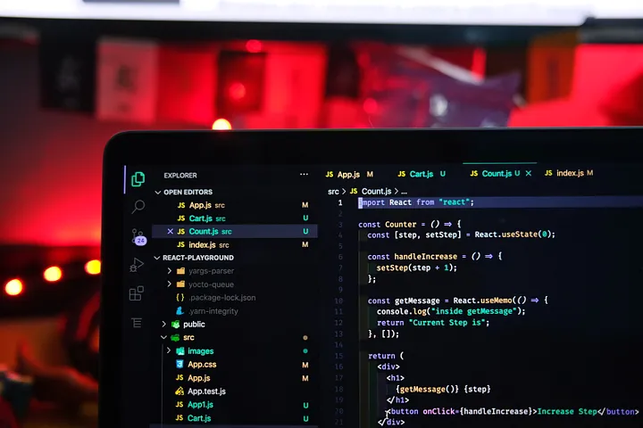
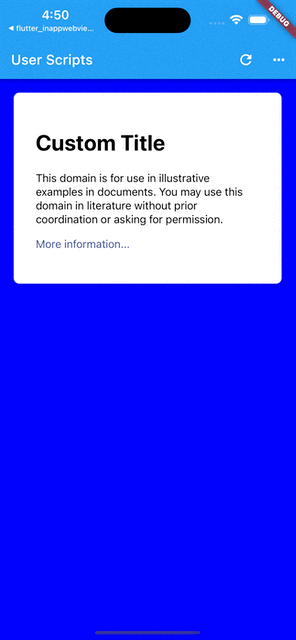

<head>
  <link rel="canonical" href="https://betterprogramming.pub/webview-javascript-injection-with-user-scripts-flutter-inappwebview-6-46d9969353a4" />
</head>

Learn how to leverage Flutter's InAppWebView 6 plugin



Sometimes you may want to inject JavaScript code before or after the web page is loaded in order to add, replace or remove content from the web page or to change some web page logic.

In this article, we are going to understand what User Scripts are and how we can use them to inject custom JavaScript code at a specific time inside the WebView using the [flutter_inappwebview](https://github.com/pichillilorenzo/flutter_inappwebview) plugin.

<!--truncate-->

### The UserScript class

The `UserScript` class is the equivalent of the [WKUserScript](https://developer.apple.com/documentation/webkit/wkuserscript) native class. It represents a JavaScript code that the WebView injects into the web page and in any other subsequent navigated web page.

What are the advantages of using User Scripts instead of just injecting some JavaScript code like, for example, the `evaluateJavascript` method?

An `UserScript` gives you the possibility to inject a JavaScript code before other resources of the web page is loaded, setting the `injectionTime` property to `UserScriptInjectionTime.AT_DOCUMENT_START`.

For each `UserScript`, you can set an optional [Content World](https://inappwebview.dev/docs/webview/javascript/content-worlds/), set whether to inject the script into the main frame using the `forMainFrameOnly` property (iOS/macOS only), and a set of matching rules for the allowed origins (Android only).

#### Note for Android

Unfortunately, on Android, when using `UserScriptInjectionTime.AT_DOCUMENT_START`, if the `WebViewFeature.DOCUMENT_START_SCRIPT` is not supported, there is no guarantee that the JavaScript code has been injected before other resources are loaded because the corresponding native class/feature doesn't exist, so `InAppWebView` tries to inject that `UserScript` as soon as possible.

To add a `UserScript` to a `WebView`, you can use the `WebView.initialUserScripts` property:

```dart
InAppWebView(  
  initialUrlRequest: URLRequest(url: WebUri('https://flutter.dev')),  
  initialUserScripts: UnmodifiableListView<UserScript>(\[  
    UserScript(  
        source: "var foo = 49;",  
        injectionTime: UserScriptInjectionTime.AT\_DOCUMENT\_START),  
    UserScript(  
        source: "var bar = 2;",  
        injectionTime: UserScriptInjectionTime.AT\_DOCUMENT\_END),  
  \]),  
  onLoadStop: (controller, url) async {  
    var result = await controller.evaluateJavascript(source: "foo + bar");  
    print(result); // 51  
  },  
),
```

For each `UserScript` you can set the following properties:

*   `groupName`: The script's group name.
*   `source`: The script's source code.
*   `injectionTime`: The time at which to inject the script into the WebView. It can be `UserScriptInjectionTime.AT_DOCUMENT_START` or `UserScriptInjectionTime.AT_DOCUMENT_END`.
*   `forMainFrameOnly`: A Boolean value that indicates whether to inject the script into the main frame. Specify true to inject the script only into the main frame, or false to inject it into all frames. The default value is `true`.
*   `allowedOriginRules`: A set of matching rules for the allowed origins. Available only on Android and only if `WebViewFeature.DOCUMENT_START_SCRIPT` feature is supported.
*   `contentWorld`: A scope of execution in which to evaluate the script to prevent conflicts between different scripts.

Check the code documentation for each specific property to know which platform supports that feature.

To add or remove User Scripts at runtime, you can also use the corresponding methods, such as `InAppWebViewController.addUserScript`, `InAppWebViewController.removeUserScript`, etc.

Note that adding or removing User Scripts at runtime, after a web page is loaded, will take no effect until the next web page load.

Also, for each `UserScript` you can define a `groupName` that you can use, for example, to remove a group of User Scripts with the `InAppWebViewController.removeUserScriptsByGroupName` method.

This is a simple overview of what it's like to add basic User Scripts to a WebView.

But, what can a User Script do?

It can do anything a normal script on the webpage can do, such as modify the HTML document structure, listen to events like [onload](https://developer.mozilla.org/en-US/docs/Web/API/Window/load_event), load external resources (images, [XMLHttpRequest](https://developer.mozilla.org/en-US/docs/Web/API/XMLHttpRequest), [fetch](https://developer.mozilla.org/en-US/docs/Web/API/Fetch_API/Using_Fetch), etc…). You can also communicate back with Flutter/Dart side (check the [official JavaScript Communication docs](https://inappwebview.dev/docs/webview/javascript/communication) for more info).

Let's put what we've learned into practice with an example!

### User Scripts example

In this example, we load the [https://example.com](https://example.com) web page with 3 custom user scripts to change some CSS styles and add some logic using a javascript handler for the two-way communication with Flutter/Dart side.

```dart
import 'dart:async';  
import 'dart:collection';  
import 'package:flutter/foundation.dart';  
import 'package:flutter/material.dart';  
import 'package:flutter\_inappwebview/flutter\_inappwebview.dart';  
  
final userScript1 = UserScript(  
    groupName: "myUserScripts",  
    source: """  
window.addEventListener('load', function(event) {  
  document.body.style.backgroundColor = 'blue';  
  document.body.style.padding = '20px';  
});  
""",  
    injectionTime: UserScriptInjectionTime.AT\_DOCUMENT\_START);  
  
final userScript2 = UserScript(  
    groupName: "myUserScripts",  
    source: """  
var h1 = document.querySelector('h1');  
h1.addEventListener('click', function(event) {  
  window.flutter\_inappwebview.callHandler('h1Click', h1.innerText);  
});  
""",  
    injectionTime: UserScriptInjectionTime.AT\_DOCUMENT\_END);  
  
final userScript3 = UserScript(  
    groupName: "myUserScripts",  
    source: "document.querySelector('h1').innerHTML = 'Custom Title';",  
    injectionTime: UserScriptInjectionTime.AT\_DOCUMENT\_END);  
  
Future main() async {  
  WidgetsFlutterBinding.ensureInitialized();  
  if (!kIsWeb &&  
      kDebugMode &&  
      defaultTargetPlatform == TargetPlatform.android) {  
    await InAppWebViewController.setWebContentsDebuggingEnabled(kDebugMode);  
  }  
  runApp(const MaterialApp(home: MyApp()));  
}  
  
class MyApp extends StatefulWidget {  
  const MyApp({Key? key}) : super(key: key);  
  
  @override  
  \_MyAppState createState() => \_MyAppState();  
}  
  
class \_MyAppState extends State<MyApp\> {  
  final GlobalKey webViewKey = GlobalKey();  
  
  InAppWebViewController? webViewController;  
  
  void handleClick(int item) async {  
    switch (item) {  
      case 0:  
        await webViewController?.removeAllUserScripts();  
        break;  
      case 1:  
        await webViewController?.addUserScript(userScript: userScript1);  
        break;  
      case 2:  
        await webViewController?.removeUserScript(userScript: userScript1);  
        break;  
      case 3:  
        await webViewController?.addUserScript(userScript: userScript2);  
        break;  
      case 4:  
        await webViewController?.removeUserScript(userScript: userScript2);  
        break;  
      case 5:  
        await webViewController?.addUserScript(userScript: userScript3);  
        break;  
      case 6:  
        await webViewController?.removeUserScript(userScript: userScript3);  
        break;  
    }  
  }  
  
  @override  
  Widget build(BuildContext context) {  
    return Scaffold(  
        appBar: AppBar(  
          title: const Text("User Scripts"),  
          actions: <Widget>\[  
            IconButton(  
                onPressed: () {  
                  webViewController?.reload();  
                },  
                icon: const Icon(Icons.refresh)),  
            PopupMenuButton<int\>(  
              onSelected: (item) => handleClick(item),  
              itemBuilder: (context) => \[  
                const PopupMenuItem<int\>(  
                    value: 0, child: Text('Remove User Scripts')),  
                const PopupMenuItem<int\>(  
                    value: 1, child: Text('Add User Script 1')),  
                const PopupMenuItem<int\>(  
                    value: 2, child: Text('Remove User Script 1')),  
                const PopupMenuItem<int\>(  
                    value: 3, child: Text('Add User Script 2')),  
                const PopupMenuItem<int\>(  
                    value: 4, child: Text('Remove User Script 2')),  
                const PopupMenuItem<int\>(  
                    value: 5, child: Text('Add User Script 3')),  
                const PopupMenuItem<int\>(  
                    value: 6, child: Text('Remove User Script 3')),  
              \],  
            ),  
          \],  
        ),  
        body: Column(children: <Widget>\[  
          Expanded(  
            child: Stack(  
              children: \[  
                InAppWebView(  
                  key: webViewKey,  
                  initialUrlRequest:  
                      URLRequest(url: WebUri('https://example.com')),  
                  initialUserScripts: UnmodifiableListView<UserScript>(  
                      \[userScript1, userScript2, userScript3\]),  
                  onWebViewCreated: (controller) {  
                    webViewController = controller;  
                    controller.addJavaScriptHandler(  
                        handlerName: 'h1Click',  
                        callback: (arguments) {  
                          final String h1InnerText = arguments\[0\];  
                          showDialog(  
                            context: context,  
                            builder: (context) {  
                              return AlertDialog(  
                                title: const Text('h1 clicked'),  
                                content: Text(h1InnerText),  
                              );  
                            },  
                          );  
                        });  
                  },  
                ),  
              \],  
            ),  
          ),  
        \]));  
  }  
}
```

Use the action buttons on the top right to remove or add the user scripts and then reload the web page for the changes to take effect.

Here is the result:



WebView offers powerful tools to manipulate JavaScript and the User Script feature is one of these.

That's all for today!

If this project helps you in any way, please consider [making a donation](https://inappwebview.dev/donate)!

Are you using this plugin? Submit your app through the [Submit App](https://inappwebview.dev/submit-app/) page and follow the instructions.  
Check the [Showcase](https://inappwebview.dev/showcase/) page to see who is already using it!

_This project follows the_ [_all-contributors_](https://github.com/all-contributors/all-contributors) _specification (_[_contributors_](https://github.com/pichillilorenzo/flutter_inappwebview#contributors-)_). I want to thank all the people that are supporting the project in any way. Thanks a lot to all of you!_