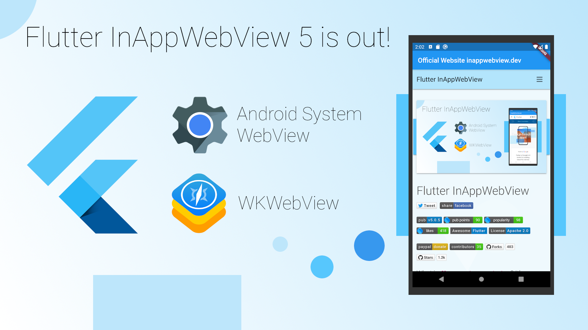

<head>
  <link rel="canonical" href="https://medium.com/@pichillilorenzo/whats-new-in-inappwebview-5-null-safety-new-features-bug-fixes-11c9e2cadab2" />
</head>



Finally, after a lot of work, the new version 5 of the [flutter_inappwebview](https://github.com/pichillilorenzo/flutter_inappwebview) plugin is out (at the time of this writing, the latest release is [5.2.0](https://pub.dev/packages/flutter_inappwebview))!

So, what's new? What changed?

Well.. a lot!

<!--truncate-->

#### Null-safety support

InAppWebView 5 comes with Dart **null-safety support**! What does this mean? We know that the null-safety feature has been released recently in the stable version of Dart (it requires Dart SDK `>=2.12.0-0 <3.0.0`), so, to use this plugin, you need to upgrade Flutter to the new version 2 or switching channel, for example, to the **dev** channel: `flutter channel dev` and, then, `flutter upgrade` (see [Switching Flutter channels](https://flutter.dev/docs/development/tools/sdk/upgrading#switching-flutter-channels)).

#### Android Hybrid Composition support

Use the new WebView Android-specific option `useHybridComposition: true` to enable Hybrid Composition.  
This will **improve** a lot the **performance** of the WebView on Android, and, also, will resolve all the problems related to the **keyboard**!  
Note that this option requires Flutter v1.20+ and should only be used on Android 10+ for release apps, as animations will drop frames on < Android 10 (see [Hybrid-Composition#performance](https://github.com/flutter/flutter/wiki/Hybrid-Composition#performance)).


#### No more URL as a String = fewer problems

All class properties that represent an URL as a `String` now have been converted to `Uri` type. Why this change? URL represented by a simple `String` could be problematic in some cases, for example when you have spaces or special chars inside it not encoded correctly.  
Using `Uri.parse()` and converting a `String` in a `Uri` will solve you a lot of problems with URLs!

Also, there is the new class `URLRequest` that represents, well, a URL load request that uses `Uri` as the type of the `url` property.  
This class is used when you want to use the `loadUrl` method or in the new WebView property `initialUrlRequest` (that replaces the old `initialUrl` and `initialHeaders` properties). A simple usage example is:

```dart
child: InAppWebView(  
  initialUrlRequest: URLRequest(  
      url: Uri.parse("https://flutter.dev/")  
  ),  
),
```

Furthermore, with `URLRequest` , you can make an initial POST request, such as:

```dart
child: InAppWebView(  
  initialUrlRequest: URLRequest(  
    url: Uri.parse("https://example.com"),  
    method: 'POST',  
    body: Uint8List.fromList(utf8.encode("name=FooBar")),  
    headers: {  
      'Content-Type': 'application/x-www-form-urlencoded'  
    }  
  ),  
),
```

Unfortunately, on Android, POST requests will ignore the headers property because there isn't any native API to load POST requests with `headers` such as `loadUrl` . That's because the native method [android.webkit.WebView.postUrl](https://developer.android.com/reference/android/webkit/WebView#postUrl%28java.lang.String,%20byte[]%29) is the only one that can send this type of request.

#### Limited Cookies support on iOS < 11.0

Because [WKHTTPCookieStore](https://developer.apple.com/documentation/webkit/wkhttpcookiestore) is available only on iOS ≥ 11.0, it has been added limited support for iOS < 11.0 through JavaScript, so, you cannot get, create or change `HttpOnly` cookies. Also, for session-only cookies, you need to use the new `iosBelow11WebViewController` argument (if available for that Cookie Manager method you want to use).

#### User Scripts

What is an `UserScript`? We can say that the `UserScript` class is the equivalent of the [WKUserScript](https://developer.apple.com/documentation/webkit/wkuserscript) iOS native class.  
Why should I use it when I can just use `evaluateJavascript` method to inject my JavaScript code? Well yes, but nope! `UserScript` gives you the possibility to inject JavaScript **before** other resources are loaded, setting the `injectionTime` property, for example, to `UserScriptInjectionTime.AT_DOCUMENT_START` (that is the equivalent of the [WKUserScriptInjectionTime.atDocumentStart](https://developer.apple.com/documentation/webkit/wkuserscriptinjectiontime/atdocumentstart) iOS native property).

However, I should make a precision here for Android. What I said is guaranteed on iOS, but not on Android (do you know that `iOS != Android`? 🤷‍♂️)!  
That's because the corresponding native class/feature doesn't exist on the Android side, so InAppWebView tries to inject all the user scripts as soon as possible. You can think of that as something like this:


To manage `UserScript`s you can use the corresponding methods, such as `addUserScript`, `removeUserScript`, etc.

#### Content Worlds

Starting from iOS 14.0+, WebKit introduces the concept of [WKContentWorld](https://developer.apple.com/documentation/webkit/wkcontentworld)s, which is an object that defines a scope of execution for JavaScript code, and which you use to prevent conflicts between different scripts.  
This concept has been introduced also into the `flutter_inappwebview` plugin with the new, you guessed it, `ContentWorld` class.

But, as I said before, `iOS != Android` and, on Android, this concept doesn't exist natively. So, it has been implemented with the usage of `<iframe>` HTML elements.


You may ask why I didn't use something like the [LiquidCore](https://github.com/LiquidPlayer/LiquidCore) library or something similar to the [JavaScriptCore](https://developer.apple.com/documentation/javascriptcore) iOS framework to implement it.  
The problem with using these libraries/framework is that you can't access the `window` or `document` JavaScript objects of the current webpage, of course.  
Instead, with `WKContentWorld`, you can access these objects and, so, you can interact with the webpage itself.  
Using `iframe`s on Android gives you the ability to create a new JavaScript context without conflicting with the main JavaScript context of the webpage (you can have, for example, 2 variables with the same name, because they exist in 2 different contexts/content worlds) and implement this sort of Content World such as on iOS. So, this plugin will create and append an `<iframe>` with `id` attribute equals to `flutter_inappwebview_[Content World Name HERE]` to the webpage's content that contains only the inline `script`s in order to define a new scope of execution for JavaScript code.

Obviously, this comes with some limitations/disadvantages:
* for any `ContentWorld`, except `ContentWorld.PAGE` (that is the webpage itself), if you need to access the `window` or `document` global Object, you need to use `window.top` and `window.top.document` because the code runs inside an `iframe`;
* the execution of the inline `script`s could be blocked by the `Content-Security-Policy` header.

A simple example:

```dart
child: InAppWebView(  
  initialUrlRequest: URLRequest(  
    url: Uri.parse("https://flutter.dev"),  
  ),  
  onLoadStop: (controller, url) async {  
    await controller.evaluateJavascript(source: "var foo = 49;");  
    await controller.evaluateJavascript(source: "var bar = 19;",  
        contentWorld: ContentWorld.PAGE);  
    print(await controller.evaluateJavascript(source: "foo + bar;"));  

    print(await controller.evaluateJavascript(source: "bar;",  
        contentWorld: ContentWorld.DEFAULT_CLIENT));  
    await controller.evaluateJavascript(source: "var bar = 2;",  
        contentWorld: ContentWorld.DEFAULT_CLIENT);  
    print(await controller.evaluateJavascript(source: "bar;",  
        contentWorld: ContentWorld.DEFAULT_CLIENT));  

    if (Platform.isIOS) {  
      await controller.evaluateJavascript(  
          source: "document.body.innerHTML = 'LOL';",  
          contentWorld: ContentWorld.world(name: "MyWorld"));  
    } else {  
      await controller.evaluateJavascript(  
          source: "window.top.document.body.innerHTML = 'LOL';",  
          contentWorld: ContentWorld.world(name: "MyWorld"));  
    }  
  },  
  onConsoleMessage: (controller, consoleMessage) {  
    print(consoleMessage);  
  },  
),
```

The proof of this example is left to the reader.

#### Apple Pay API

A new WebView option has been added for iOS 13.0+ to enable the JavaScript Apple Pay API: `applePayAPIEnabled`. As written in the official [Safari 13 Release Notes](https://developer.apple.com/documentation/safari-release-notes/safari-13-release-notes#Payment-Request-API), it won't work if any script injection APIs are used (such as `evaluateJavascript` or `UserScript`).  
So, when this attribute is `true`, all the methods, options, and events implemented using JavaScript on iOS won't be called or won't do anything and the result will always be `null`, but, hey, you will get paid from your users 🤑 (that's good, no?).

Check the official `flutter_inappwebview` documentation for the full list of API affected by this!

#### Evaluate Async JavaScript code

Starting from iOS 14.0+, WebKit added the new [callAsyncJavaScript](https://developer.apple.com/documentation/webkit/wkwebview/3656441-callasyncjavascript) method, which allows the execution of the source code as an asynchronous JavaScript function (see [MDN — async function](https://developer.mozilla.org/en-US/docs/Web/JavaScript/Reference/Statements/async_function)). This method has been implemented on both Android and iOS platforms.

On iOS, you can use this function starting from iOS 10.3+ because, as stated here: [async function Browser Compatibility](https://developer.mozilla.org/en-US/docs/Web/JavaScript/Reference/Statements/async_function#browser_compatibility), async functions should be already supported from that version. So, for iOS versions inside the range [10.3, 14.0), it has been implemented using the `evaluateJavascript` method and using a `Map` that contains an identifier and a callback that will be called at the end of the async function execution with the returned result. On Android, it has been implemented the same way!

The return type is not the same as the `evaluateJavascript` method, but a `CallAsyncJavaScriptResult` instance, where the `value` property contains the success value (if any) and the `error` property contains a `String` representing the failure value (if any).

Here is an example:
```dart
child: InAppWebView(  
  initialUrlRequest: URLRequest(  
    url: Uri.parse("https://flutter.dev"),  
  ),  
  onLoadStop: (controller, url) async {  
    final String functionBody = """  
        var p = new Promise(function (resolve, reject) {  
           window.setTimeout(function() {  
             if (x >= 0) {  
               resolve(x);  
             } else {  
               reject(y);  
             }  
           }, 1000);  
        });  
        await p;  
        return p;  
      """;  

    var result = await controller.callAsyncJavaScript(  
        functionBody: functionBody,  
        arguments: {'x': 49, 'y': 'error message'});  
    print(result);  

    result = await controller.callAsyncJavaScript(  
        functionBody: functionBody,  
        arguments: {'x': -49, 'y': 'error message'});  
    print(result);  
  },  
),
```

that will print `{value: 49, error: null}` and `{value: null, error: "error message"}` respectively.

#### Service Worker API

On Android, the `AndroidServiceWorkerController` and `AndroidServiceWorkerClient` classes can be used to intercept requests. Before using these classes or their methods, you should check if the service worker features you want to use are supported or not, for example:

```dart
Future main() async {  
  WidgetsFlutterBinding.ensureInitialized();

  if (Platform.isAndroid) {  
    await AndroidInAppWebViewController.setWebContentsDebuggingEnabled(true);

    var swAvailable = await AndroidWebViewFeature.isFeatureSupported(AndroidWebViewFeature.SERVICE_WORKER_BASIC_USAGE);  
    var swInterceptAvailable = await AndroidWebViewFeature.isFeatureSupported(AndroidWebViewFeature.SERVICE_WORKER_SHOULD_INTERCEPT_REQUEST);

    if (swAvailable && swInterceptAvailable) {  
      AndroidServiceWorkerController serviceWorkerController = AndroidServiceWorkerController.instance();

      serviceWorkerController.serviceWorkerClient = AndroidServiceWorkerClient(  
        shouldInterceptRequest: (request) async {  
          print(request);  
          return null;  
        },  
      );  
    }  
  }

  runApp(MyApp());  
}
```

Instead, on iOS, the JavaScript Service Worker API is available starting from iOS 14.0+.

To enable this JavaScript API on iOS there are only 2 ways:

* using "App-Bound Domains"
* your App proposes itself as a possible "Default Browser" such as iOS Safari or Google Chrome

**App-Bound Domains**: read the [WebKit — App-Bound Domains](https://webkit.org/blog/10882/app-bound-domains/) article for details. You can specify up to 10 "app-bound" domains using the new Info.plist key `WKAppBoundDomains`, for example:

```xml
<dict>  
<key>WKAppBoundDomains</key>  
<array>  
    <string>flutter.dev</string>  
    <string>github.com</string>  
</array>  
</dict>
```

After that, you need to set to `true` the `limitsNavigationsToAppBoundDomains` iOS-specific WebView option, for example:

```dart
InAppWebViewGroupOptions(  
  ios: IOSInAppWebViewOptions(  
    limitsNavigationsToAppBoundDomains: true  
  )  
)
```

**iOS Default Browser**: read the [Preparing Your App to be the Default Browser or Email Client](https://developer.apple.com/documentation/xcode/allowing_apps_and_websites_to_link_to_your_content/preparing_your_app_to_be_the_default_browser_or_email_client) article for details.

#### Web Message Channels and Web Message Listeners

There are two new ways to communicate with JavaScript other than JavaScript Handlers:
* **Web Message Channels**: they are the representation of the [HTML5 message channels](https://html.spec.whatwg.org/multipage/web-messaging.html#message-channels). See [Channel Messaging API](https://developer.mozilla.org/en-US/docs/Web/API/Channel_Messaging_API) for more details. To create a Web Message Channel, you need to use the `InAppWebViewController.createWebMessageChannel` method. This method should be called when the page is loaded, for example, when the `WebView.onLoadStop` event is fired.
* **Web Message Listeners**: It allows to inject a JavaScript object into each frame that the `WebMessageListener` will listen on. To add a Web Message Listener, you need to use the `InAppWebViewController.addWebMessageListener` method. This method should be called before the webpage that uses it is loaded, for example when the `WebView.onWebViewCreated` event is fired.

#### Official WebSite

The official website of this plugin has been published on [inappwebview.dev](https://inappwebview.dev/)!  
All the initial setup and configuration written on the README.md of the repository have been moved to the new [Docs page](https://inappwebview.dev/docs/)!

Also, it contains a [Showcase](https://inappwebview.dev/showcase/) section with an open list of apps built with Flutter and Flutter InAppWebView. At this time, because the website is new, there is only one App, that is the [Flutter Browser App](https://inappwebview.dev/flutter-app/flutter-browser/).

Are you using this plugin? Submit your app through the [Submit App](https://inappwebview.dev/submit-app/) page and follow the instructions!

#### Conclusion

Check the [CHANGELOG.md](https://github.com/pichillilorenzo/flutter_inappwebview/blob/master/CHANGELOG.md) file to see the full list of what is changed and what is fixed!

That's all for today!

I want to thank all the people that are supporting the project in any way! Thanks a lot to all of you! 💙
