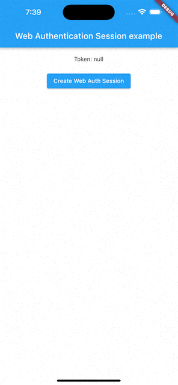

import {Platform} from "../src/Platform.enum";
import {SupportedPlatforms} from '../src/components/SupportedPlatforms';

<SupportedPlatforms
    platforms={[{platform: Platform.iOS, version: '11.0'}, {platform: Platform.macOS, version: '10.15'}]}></SupportedPlatforms>

`WebAuthenticationSession` represents a session that an app uses to authenticate a user through a web service.
It's available only on iOS 11.0+ and macOS 10.15+ and it is implemented using
[ASWebAuthenticationSession](https://developer.apple.com/documentation/authenticationservices/aswebauthenticationsession) on iOS 12.0+ and macOS 10.15+
and [SFAuthenticationSession](https://developer.apple.com/documentation/safariservices/sfauthenticationsession) on iOS 11.0.

## Basic Usage

Use an `WebAuthenticationSession` instance to authenticate a user through a web service, including one run by a third party.
Initialize the session with a URL that points to the authentication webpage. The URL must use the `https` or `http` protocol.
A browser loads and displays the page, from which the user can authenticate.
In iOS, the browser is a secure, embedded web view.
In macOS, the system opens the user’s default browser if it supports web authentication sessions, or Safari otherwise.

On completion, the service sends a callback URL to the session with an authentication token,
and the session passes this URL back to the app through a completion handler.
`WebAuthenticationSession` ensures that only the calling app's session receives the authentication callback,
even when more than one app registers the same callback URL scheme.

:::caution
Remember to dispose it when you don't need it anymore using the `WebAuthenticationSession.dispose` method.
:::

To create a session, use the `WebAuthenticationSession.create` static method.
After that, use `canStart` method to check if the session can begin, and then use the `start` method,
that also returns a boolean value indicating whether the web authentication session started successfully.

In the following example, I'm running a localhost server using `InAppLocalhostServer` to load
a simple local web page inside the `assets` folder through the `http` protocol.

Web page HTML code:
```html
<!DOCTYPE html>
<html lang="en">
<head>
    <meta charset="UTF-8">
    <meta name="viewport" content="width=device-width, user-scalable=no, initial-scale=1.0, maximum-scale=1.0, minimum-scale=1.0">
    <meta http-equiv="X-UA-Compatible" content="ie=edge">
    <title>Web Auth</title>
</head>
<body>
    <form id="form" method="GET" action="test://callback-url">
        <input type="text" name="token" placeholder="token example">
        <input type="submit" value="Submit">
    </form>
</body>
</html>
```

Example:
```dart
import 'dart:async';
import 'package:flutter/foundation.dart';
import 'package:flutter/material.dart';
import 'package:flutter_inappwebview/flutter_inappwebview.dart';

InAppLocalhostServer localhostServer = InAppLocalhostServer();

Future main() async {
  WidgetsFlutterBinding.ensureInitialized();

  if (!kIsWeb) {
    await localhostServer.start();
  }

  runApp(const MaterialApp(home: MyApp()));
}

class MyApp extends StatefulWidget {
  const MyApp({super.key});

  @override
  State<MyApp> createState() => _MyAppState();
}

class _MyAppState extends State<MyApp> {
  final GlobalKey webViewKey = GlobalKey();

  WebAuthenticationSession? session;
  String? token;

  @override
  void dispose() {
    session?.dispose();
    super.dispose();
  }

  @override
  Widget build(BuildContext context) {
    return Scaffold(
        appBar: AppBar(title: const Text('Web Authentication Session example')),
        body: Column(children: <Widget>[
          Center(
              child: Container(
            padding: const EdgeInsets.all(20.0),
            child: Text("Token: $token"),
          )),
          session != null
              ? Container()
              : Center(
                  child: ElevatedButton(
                      onPressed: () async {
                        if (session == null &&
                            !kIsWeb &&
                            defaultTargetPlatform == TargetPlatform.iOS &&
                            await WebAuthenticationSession.isAvailable()) {
                          session = await WebAuthenticationSession.create(
                              url: WebUri(
                                  "http://localhost:8080/assets/web-auth.html"),
                              callbackURLScheme: "test",
                              onComplete: (url, error) async {
                                if (url != null) {
                                  setState(() {
                                    token = url.queryParameters["token"];
                                  });
                                }
                              });
                          setState(() {});
                        } else {
                          ScaffoldMessenger.of(context)
                              .showSnackBar(const SnackBar(
                            content: Text(
                                'Cannot create Web Authentication Session!'),
                          ));
                        }
                      },
                      child: const Text("Create Web Auth Session")),
                ),
          session == null
              ? Container()
              : Center(
                  child: ElevatedButton(
                      onPressed: () async {
                        var started = false;
                        if (await session?.canStart() ?? false) {
                          started = await session?.start() ?? false;
                        }
                        if (!started) {
                          ScaffoldMessenger.of(context)
                              .showSnackBar(const SnackBar(
                            content: Text(
                                'Cannot start Web Authentication Session!'),
                          ));
                        }
                      },
                      child: const Text("Start Web Auth Session")),
                ),
          session == null
              ? Container()
              : Center(
                  child: ElevatedButton(
                      onPressed: () async {
                        await session?.dispose();
                        setState(() {
                          token = null;
                          session = null;
                        });
                      },
                      child: const Text("Dispose Web Auth Session")),
                )
        ]));
  }
}
```

This is the result:


