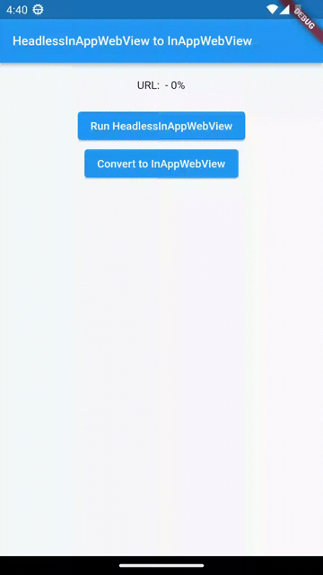
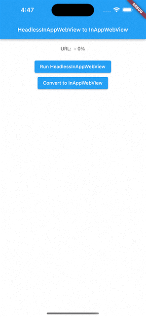

import Tabs from '@theme/Tabs';
import TabItem from '@theme/TabItem';

# Headless InAppWebView

The `HeadlessInAppWebView` class  represents a WebView in headless mode.
It can be used to run a WebView in background without attaching an `InAppWebView` to the widget tree.

## Basic Usage

As `InAppWebView`, it has the same options and events. Use `InAppWebViewController` to control the WebView instance.

:::caution
Remember to dispose it when you don't need it anymore using the `HeadlessInAppWebView.dispose` method.
:::

The initial width and height of the Headless WebView will match the device screen size, and it is represented by `Size(-1, -1)`.
If you need to define a different initial size, you can use the `initialSize` property, for example `initialSize: Size(600, 800)`.
To get the current size, you can use the `HeadlessInAppWebView.getSize` method.
Instead, if you need to change the current size, you can use the `HeadlessInAppWebView.setSize` method.

:::info
Note that if the `HeadlessInAppWebView` is not running, the `getSize` method will return `null` and `setSize` method won't have effect.
:::

Example:
```dart
import 'dart:async';
import 'package:flutter/foundation.dart';
import 'package:flutter/material.dart';
import 'package:flutter_inappwebview/flutter_inappwebview.dart';

Future main() async {
  WidgetsFlutterBinding.ensureInitialized();

  if (!kIsWeb && defaultTargetPlatform == TargetPlatform.android) {
    await InAppWebViewController.setWebContentsDebuggingEnabled(kDebugMode);
  }

  runApp(const MaterialApp(home: MyApp()));
}

class MyApp extends StatefulWidget {
  const MyApp({super.key});

  @override
  State<MyApp> createState() => _MyAppState();
}

class _MyAppState extends State<MyApp> {
  HeadlessInAppWebView? headlessWebView;
  String url = "";

  @override
  void initState() {
    super.initState();

    headlessWebView = HeadlessInAppWebView(
      initialUrlRequest: URLRequest(url: WebUri("https://github.com/flutter")),
      initialSettings: InAppWebViewSettings(isInspectable: kDebugMode),
      onWebViewCreated: (controller) {
        const snackBar = SnackBar(
          content: Text('HeadlessInAppWebView created!'),
          duration: Duration(seconds: 1),
        );
        ScaffoldMessenger.of(context).showSnackBar(snackBar);
      },
      onConsoleMessage: (controller, consoleMessage) {
        final snackBar = SnackBar(
          content: Text('Console Message: ${consoleMessage.message}'),
          duration: const Duration(seconds: 1),
        );
        ScaffoldMessenger.of(context).showSnackBar(snackBar);
      },
      onLoadStart: (controller, url) async {
        final snackBar = SnackBar(
          content: Text('onLoadStart $url'),
          duration: const Duration(seconds: 1),
        );
        ScaffoldMessenger.of(context).showSnackBar(snackBar);

        setState(() {
          this.url = url?.toString() ?? '';
        });
      },
      onLoadStop: (controller, url) async {
        final snackBar = SnackBar(
          content: Text('onLoadStop $url'),
          duration: const Duration(seconds: 1),
        );
        ScaffoldMessenger.of(context).showSnackBar(snackBar);

        setState(() {
          this.url = url?.toString() ?? '';
        });
      },
    );
  }

  @override
  void dispose() {
    super.dispose();
    headlessWebView?.dispose();
  }

  @override
  Widget build(BuildContext context) {
    return Scaffold(
        appBar: AppBar(
            title: const Text(
          "HeadlessInAppWebView Example",
        )),
        body: SafeArea(
            child: Column(children: <Widget>[
          Container(
            padding: const EdgeInsets.all(20.0),
            child: Text(
                "URL: ${(url.length > 50) ? "${url.substring(0, 50)}..." : url}"),
          ),
          Center(
            child: ElevatedButton(
                onPressed: () async {
                  await headlessWebView?.dispose();
                  await headlessWebView?.run();
                },
                child: const Text("Run HeadlessInAppWebView")),
          ),
          Center(
            child: ElevatedButton(
                onPressed: () async {
                  if (headlessWebView?.isRunning() ?? false) {
                    await headlessWebView?.webViewController
                        ?.evaluateJavascript(
                            source: "console.log('Here is the message!');");
                  } else {
                    const snackBar = SnackBar(
                      content: Text(
                          'HeadlessInAppWebView is not running. Click on "Run HeadlessInAppWebView"!'),
                      duration: Duration(milliseconds: 1500),
                    );
                    ScaffoldMessenger.of(context).showSnackBar(snackBar);
                  }
                },
                child: const Text("Send console.log message")),
          ),
          Center(
            child: ElevatedButton(
                onPressed: () {
                  headlessWebView?.dispose();
                  setState(() {
                    url = '';
                  });
                },
                child: const Text("Dispose HeadlessInAppWebView")),
          )
        ])));
  }
}
```

This is the result:

```mdx-code-block
<Tabs>
  <TabItem value="android" label="Android" default>
```

```mdx-code-block
  </TabItem>
  <TabItem value="ios" label="iOS">
```

```mdx-code-block
  </TabItem>
</Tabs>
```

## Convert to an InAppWebView widget

It's possible to convert a `HeadlessInAppWebView` to an `InAppWebView` widget using the `InAppWebView.headlessWebView` property.

When you create an `InAppWebView` widget this way, the `HeadlessInAppWebView` instance
will be automatically disposed when the `InAppWebView.onWebViewCreated` event is fired.

When the `InAppWebView` widget is created, it won't use any of the initial properties (such as `initialSettings`, `initialUrlRequest`, etc...),
context menu and controllers (`PullToRefreshController` and `FindInteractionController`).
All of these properties are inherited from the `HeadlessInAppWebView`.

So, if you need to enable specific settings, use the pull-to-refresh feature, etc..., you need to declare them when you create
the `HeadlessInAppWebView` instance, before passing it to the `InAppWebView.headlessWebView` property.

Example:
```dart
import 'dart:async';
import 'package:flutter/foundation.dart';
import 'package:flutter/material.dart';
import 'package:flutter_inappwebview/flutter_inappwebview.dart';

Future main() async {
  WidgetsFlutterBinding.ensureInitialized();

  if (!kIsWeb && defaultTargetPlatform == TargetPlatform.android) {
    await InAppWebViewController.setWebContentsDebuggingEnabled(kDebugMode);
  }

  runApp(const MaterialApp(home: MyApp()));
}

class MyApp extends StatefulWidget {
  const MyApp({super.key});

  @override
  State<MyApp> createState() => _MyAppState();
}

class _MyAppState extends State<MyApp> {
  HeadlessInAppWebView? headlessWebView;
  PullToRefreshController? pullToRefreshController;
  InAppWebViewController? webViewController;

  String url = "";
  int progress = 0;
  bool convertFlag = false;

  @override
  void initState() {
    super.initState();

    pullToRefreshController = kIsWeb ||
            ![TargetPlatform.iOS, TargetPlatform.android]
                .contains(defaultTargetPlatform)
        ? null
        : PullToRefreshController(
            settings: PullToRefreshSettings(
              color: Colors.blue,
            ),
            onRefresh: () async {
              if (defaultTargetPlatform == TargetPlatform.android) {
                webViewController?.reload();
              } else if (defaultTargetPlatform == TargetPlatform.iOS ||
                  defaultTargetPlatform == TargetPlatform.macOS) {
                webViewController?.loadUrl(
                    urlRequest:
                        URLRequest(url: await webViewController?.getUrl()));
              }
            },
          );

    headlessWebView = HeadlessInAppWebView(
      initialUrlRequest: URLRequest(url: WebUri("https://flutter.dev")),
      initialSettings: InAppWebViewSettings(isInspectable: kDebugMode),
      pullToRefreshController: pullToRefreshController,
      onWebViewCreated: (controller) {
        webViewController = controller;

        const snackBar = SnackBar(
          content: Text('HeadlessInAppWebView created!'),
          duration: Duration(seconds: 1),
        );
        ScaffoldMessenger.of(context).showSnackBar(snackBar);
      },
      onLoadStart: (controller, url) async {
        setState(() {
          this.url = url?.toString() ?? '';
        });
      },
      onProgressChanged: (controller, progress) {
        setState(() {
          this.progress = progress;
        });
      },
      onLoadStop: (controller, url) async {
        setState(() {
          this.url = url?.toString() ?? '';
        });
      },
    );
  }

  @override
  void dispose() {
    super.dispose();
    headlessWebView?.dispose();
  }

  @override
  Widget build(BuildContext context) {
    return Scaffold(
        appBar: AppBar(
            title: const Text(
          "HeadlessInAppWebView to InAppWebView",
          textScaleFactor: .8,
        )),
        body: Column(children: <Widget>[
          Container(
            padding: const EdgeInsets.all(20.0),
            child: Text(
                "URL: ${(url.length > 40) ? "${url.substring(0, 40)}..." : url} - $progress%"),
          ),
          !convertFlag
              ? Center(
                  child: ElevatedButton(
                      onPressed: () async {
                        var headlessWebView = this.headlessWebView;
                        if (headlessWebView != null &&
                            !headlessWebView.isRunning()) {
                          await headlessWebView.run();
                        }
                      },
                      child: const Text("Run HeadlessInAppWebView")),
                )
              : Container(),
          !convertFlag
              ? Center(
                  child: ElevatedButton(
                      onPressed: () {
                        if (!convertFlag) {
                          setState(() {
                            convertFlag = true;
                          });
                        }
                      },
                      child: const Text("Convert to InAppWebView")),
                )
              : Container(),
          convertFlag
              ? Expanded(
                  child: InAppWebView(
                  headlessWebView: headlessWebView,
                  onWebViewCreated: (controller) {
                    headlessWebView = null;
                    webViewController = controller;

                    const snackBar = SnackBar(
                      content: Text(
                          'HeadlessInAppWebView converted to InAppWebView!'),
                      duration: Duration(seconds: 1),
                    );
                    ScaffoldMessenger.of(context).showSnackBar(snackBar);
                  },
                  onLoadStart: (controller, url) {
                    setState(() {
                      this.url = url?.toString() ?? "";
                    });
                  },
                  onProgressChanged: (controller, progress) {
                    if (progress == 100) {
                      pullToRefreshController?.endRefreshing();
                    }
                    setState(() {
                      this.progress = progress;
                    });
                  },
                  onLoadStop: (controller, url) {
                    pullToRefreshController?.endRefreshing();
                    setState(() {
                      this.url = url?.toString() ?? "";
                    });
                  },
                  onReceivedError: (controller, request, error) {
                    pullToRefreshController?.endRefreshing();
                  },
                ))
              : Container()
        ]));
  }
}
```

This is the result:

```mdx-code-block
<Tabs>
  <TabItem value="android" label="Android" default>
```

```mdx-code-block
  </TabItem>
  <TabItem value="ios" label="iOS">
```

```mdx-code-block
  </TabItem>
</Tabs>
```
