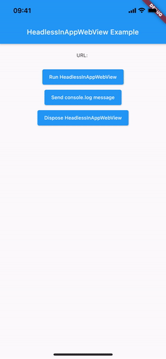

import Tabs from '@theme/Tabs';
import TabItem from '@theme/TabItem';

# Headless InAppWebView

The `HeadlessInAppWebView` class  represents a WebView in headless mode.
It can be used to run a WebView in background without attaching an `InAppWebView` to the widget tree.

## Basic Usage

As `InAppWebView`, it has the same options and events. Use `InAppWebViewController` to control the WebView instance.

:::caution
Remember to dispose it when you don't need it anymore using the `HeadlessInAppWebView.dispose` method.
:::

The initial width and height of the Headless WebView will match the device screen size, and it is represented by `Size(-1, -1)`.
If you need to define a different initial size, you can use the `initialSize` property, for example `initialSize: Size(600, 800)`.
To get the current size, you can use the `HeadlessInAppWebView.getSize` method.
Instead, if you need to change the current size, you can use the `HeadlessInAppWebView.setSize` method.

:::info
Note that if the `HeadlessInAppWebView` is not running, the `getSize` method will return `null` and `setSize` method won't have effect.
:::

Example:
```dart
import 'dart:async';
import 'package:flutter/foundation.dart';
import 'package:flutter/material.dart';
import 'package:flutter_inappwebview/flutter_inappwebview.dart';

Future main() async {
  WidgetsFlutterBinding.ensureInitialized();

  if (defaultTargetPlatform == TargetPlatform.android) {
    await InAppWebViewController.setWebContentsDebuggingEnabled(true);
  }

  runApp(MaterialApp(home: new MyApp()));
}

class MyApp extends StatefulWidget {
  @override
  _MyAppState createState() => new _MyAppState();
}

class _MyAppState extends State<MyApp> {
  HeadlessInAppWebView? headlessWebView;
  String url = "";

  @override
  void initState() {
    super.initState();

    headlessWebView = new HeadlessInAppWebView(
      initialUrlRequest:
          URLRequest(url: Uri.parse("https://github.com/flutter")),
      onWebViewCreated: (controller) {
        final snackBar = SnackBar(
          content: Text('HeadlessInAppWebView created!'),
          duration: Duration(seconds: 1),
        );
        ScaffoldMessenger.of(context).showSnackBar(snackBar);
      },
      onConsoleMessage: (controller, consoleMessage) {
        final snackBar = SnackBar(
          content: Text('Console Message: ${consoleMessage.message}'),
          duration: Duration(seconds: 1),
        );
        ScaffoldMessenger.of(context).showSnackBar(snackBar);
      },
      onLoadStart: (controller, url) async {
        final snackBar = SnackBar(
          content: Text('onLoadStart $url'),
          duration: Duration(seconds: 1),
        );
        ScaffoldMessenger.of(context).showSnackBar(snackBar);

        setState(() {
          this.url = url?.toString() ?? '';
        });
      },
      onLoadStop: (controller, url) async {
        final snackBar = SnackBar(
          content: Text('onLoadStop $url'),
          duration: Duration(seconds: 1),
        );
        ScaffoldMessenger.of(context).showSnackBar(snackBar);

        setState(() {
          this.url = url?.toString() ?? '';
        });
      },
    );
  }

  @override
  void dispose() {
    super.dispose();
    headlessWebView?.dispose();
  }

  @override
  Widget build(BuildContext context) {
    return Scaffold(
        appBar: AppBar(
            title: Text(
          "HeadlessInAppWebView Example",
        )),
        body: SafeArea(
            child: Column(children: <Widget>[
          Container(
            padding: EdgeInsets.all(20.0),
            child: Text(
                "URL: ${(url.length > 50) ? url.substring(0, 50) + "..." : url}"),
          ),
          Center(
            child: ElevatedButton(
                onPressed: () async {
                  await headlessWebView?.dispose();
                  await headlessWebView?.run();
                },
                child: Text("Run HeadlessInAppWebView")),
          ),
          Center(
            child: ElevatedButton(
                onPressed: () async {
                  if (headlessWebView?.isRunning() ?? false) {
                    await headlessWebView?.webViewController.evaluateJavascript(
                        source: "console.log('Here is the message!');");
                  } else {
                    final snackBar = SnackBar(
                      content: Text(
                          'HeadlessInAppWebView is not running. Click on "Run HeadlessInAppWebView"!'),
                      duration: Duration(milliseconds: 1500),
                    );
                    ScaffoldMessenger.of(context).showSnackBar(snackBar);
                  }
                },
                child: Text("Send console.log message")),
          ),
          Center(
            child: ElevatedButton(
                onPressed: () {
                  headlessWebView?.dispose();
                  setState(() {
                    this.url = '';
                  });
                },
                child: Text("Dispose HeadlessInAppWebView")),
          )
        ])));
  }
}
```

This is the result:

```mdx-code-block
<Tabs>
  <TabItem value="android" label="Android" default>
```

```mdx-code-block
  </TabItem>
  <TabItem value="ios" label="iOS">
```

```mdx-code-block
  </TabItem>
</Tabs>
```
