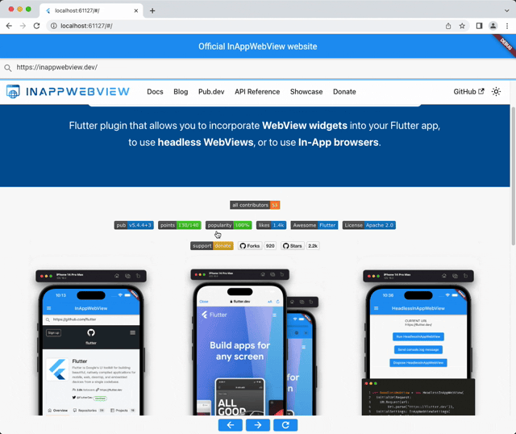

import Tabs from '@theme/Tabs';
import TabItem from '@theme/TabItem';

# InAppWebView

`InAppWebView` is a Flutter Widget for adding an **inline native WebView** integrated into the flutter widget tree.

The plugin relies on Flutter's mechanism for embedding Android and iOS native views: [AndroidView](https://api.flutter.dev/flutter/widgets/AndroidView-class.html) and [UiKitView](https://api.flutter.dev/flutter/widgets/UiKitView-class.html).
Known issues are tagged with the [platform-views](https://github.com/flutter/flutter/labels/a%3A%20platform-views) label in the [Flutter official repo](https://github.com/flutter/flutter).

On Web platform, the WebView is embedded using the [iframe](https://developer.mozilla.org/en-US/docs/Web/HTML/Element/iframe) HTML element.

:::caution Web platform limitation
Because of the nature of the [iframe](https://developer.mozilla.org/en-US/docs/Web/HTML/Element/iframe), the Web platform has a lot of limitations regarding WebView control.
Most of the `InAppWebViewController` methods are impossible to be implemented, and the ones that are, require the iframe to have the same origin of the website.

Check the documentation of each specific method you want to use to understand if it is supported or not.
:::

## Basic Usage

:::caution
  It requires *Android API 20+* (see [AndroidView](https://api.flutter.dev/flutter/widgets/AndroidView-class.html)) or *Android API 19+* if you set the `useHybridComposition: true` Android-specific option.
:::

Use `InAppWebViewController` to control the WebView instance.

Example:
```dart
import 'dart:async';
import 'package:flutter/foundation.dart';
import 'package:flutter/material.dart';
import 'package:flutter_inappwebview/flutter_inappwebview.dart';
import 'package:url_launcher/url_launcher.dart';

Future main() async {
  WidgetsFlutterBinding.ensureInitialized();

  if (defaultTargetPlatform == TargetPlatform.android) {
    await InAppWebViewController.setWebContentsDebuggingEnabled(true);
  }

  runApp(MaterialApp(home: new MyApp()));
}

class MyApp extends StatefulWidget {
  @override
  _MyAppState createState() => new _MyAppState();
}

class _MyAppState extends State<MyApp> {
  final GlobalKey webViewKey = GlobalKey();

  InAppWebViewController? webViewController;
  InAppWebViewSettings settings = InAppWebViewSettings(
    useShouldOverrideUrlLoading: true,
    mediaPlaybackRequiresUserGesture: false,
    allowsInlineMediaPlayback: true,
    iframeAllow: "camera; microphone",
    iframeAllowFullscreen: true
  );

  late PullToRefreshController pullToRefreshController;
  String url = "";
  double progress = 0;
  final urlController = TextEditingController();

  @override
  void initState() {
    super.initState();

    pullToRefreshController = PullToRefreshController(
      settings: PullToRefreshSettings(
        color: Colors.blue,
      ),
      onRefresh: () async {
        if (defaultTargetPlatform == TargetPlatform.android) {
          webViewController?.reload();
        } else if (defaultTargetPlatform == TargetPlatform.iOS) {
          webViewController?.loadUrl(
              urlRequest: URLRequest(url: await webViewController?.getUrl()));
        }
      },
    );
  }

  @override
  void dispose() {
    super.dispose();
  }

  @override
  Widget build(BuildContext context) {
    return Scaffold(
        appBar: AppBar(title: Text("Official InAppWebView website")),
        body: SafeArea(
            child: Column(children: <Widget>[
          TextField(
            decoration: InputDecoration(prefixIcon: Icon(Icons.search)),
            controller: urlController,
            keyboardType: TextInputType.url,
            onSubmitted: (value) {
              var url = Uri.parse(value);
              if (url.scheme.isEmpty) {
                url = Uri.parse("https://www.google.com/search?q=" + value);
              }
              webViewController?.loadUrl(urlRequest: URLRequest(url: url));
            },
          ),
          Expanded(
            child: Stack(
              children: [
                InAppWebView(
                  key: webViewKey,
                  initialUrlRequest:
                      URLRequest(url: Uri.parse("https://inappwebview.dev/")),
                  initialSettings: settings,
                  pullToRefreshController: pullToRefreshController,
                  onWebViewCreated: (controller) {
                    webViewController = controller;
                  },
                  onLoadStart: (controller, url) {
                    setState(() {
                      this.url = url.toString();
                      urlController.text = this.url;
                    });
                  },
                  onPermissionRequest: (controller, request) async {
                    return PermissionResponse(
                        resources: request.resources,
                        action: PermissionResponseAction.GRANT);
                  },
                  shouldOverrideUrlLoading:
                      (controller, navigationAction) async {
                    var uri = navigationAction.request.url!;

                    if (![
                      "http",
                      "https",
                      "file",
                      "chrome",
                      "data",
                      "javascript",
                      "about"
                    ].contains(uri.scheme)) {
                      if (await canLaunchUrl(uri)) {
                        // Launch the App
                        await launchUrl(
                          uri,
                        );
                        // and cancel the request
                        return NavigationActionPolicy.CANCEL;
                      }
                    }

                    return NavigationActionPolicy.ALLOW;
                  },
                  onLoadStop: (controller, url) async {
                    pullToRefreshController.endRefreshing();
                    setState(() {
                      this.url = url.toString();
                      urlController.text = this.url;
                    });
                  },
                  onReceivedError: (controller, request, error) {
                    pullToRefreshController.endRefreshing();
                  },
                  onProgressChanged: (controller, progress) {
                    if (progress == 100) {
                      pullToRefreshController.endRefreshing();
                    }
                    setState(() {
                      this.progress = progress / 100;
                      urlController.text = this.url;
                    });
                  },
                  onUpdateVisitedHistory: (controller, url, androidIsReload) {
                    setState(() {
                      this.url = url.toString();
                      urlController.text = this.url;
                    });
                  },
                  onConsoleMessage: (controller, consoleMessage) {
                    print(consoleMessage);
                  },
                ),
                progress < 1.0
                    ? LinearProgressIndicator(value: progress)
                    : Container(),
              ],
            ),
          ),
          ButtonBar(
            alignment: MainAxisAlignment.center,
            children: <Widget>[
              ElevatedButton(
                child: Icon(Icons.arrow_back),
                onPressed: () {
                  webViewController?.goBack();
                },
              ),
              ElevatedButton(
                child: Icon(Icons.arrow_forward),
                onPressed: () {
                  webViewController?.goForward();
                },
              ),
              ElevatedButton(
                child: Icon(Icons.refresh),
                onPressed: () {
                  webViewController?.reload();
                },
              ),
            ],
          ),
        ])));
  }
}
```

This is the result:

```mdx-code-block
<Tabs>
  <TabItem value="android" label="Android" default>
```

```mdx-code-block
  </TabItem>
  <TabItem value="ios" label="iOS">
```

```mdx-code-block
  </TabItem>
  <TabItem value="web" label="Web">
```

```mdx-code-block
  </TabItem>
</Tabs>
```
