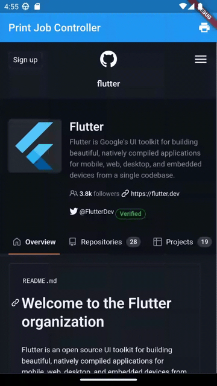
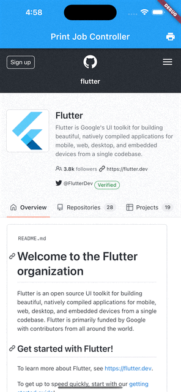

import Tabs from '@theme/Tabs';
import TabItem from '@theme/TabItem';
import config from '../../docusaurus.config';

<head>
  <title>WebView Print Job Controller | {config.title}</title>
</head>

`PrintJobController` represents the controller used by the `WebView` to manage print jobs.

## Basic Usage

A `PrintJobController` is returned by the `InAppWebViewController.printCurrentPage(PrintJobSettings? settings)` method or
as an argument when the `onPrintRequest` event is fired.

:::caution
Remember to dispose it when you don't need it anymore using the `PrintJobController.dispose` method.
:::

To obtain the `PrintJobController` instance from the `InAppWebViewController.printCurrentPage(PrintJobSettings? settings)` method,
you need to set `PrintJobSettings.handledByClient` to `true`:

```dart
final printJobController = await webViewController.printCurrentPage(settings: PrintJobSettings(handledByClient: true));
```

Instead, to be able to handle the `PrintJobController` coming from the `onPrintRequest` event, you need to return `true`:
```dart
onPrintRequest: (controller, url, printJobController) async {
  // handle the print job
  return true;
},
```

Example:
```dart
import 'dart:async';
import 'package:flutter/foundation.dart';
import 'package:flutter/material.dart';
import 'package:flutter_inappwebview/flutter_inappwebview.dart';

Future main() async {
  WidgetsFlutterBinding.ensureInitialized();

  if (defaultTargetPlatform == TargetPlatform.android) {
    await InAppWebViewController.setWebContentsDebuggingEnabled(true);
  }

  runApp(MaterialApp(home: new MyApp()));
}

class MyApp extends StatefulWidget {
  @override
  _MyAppState createState() => new _MyAppState();
}

class _MyAppState extends State<MyApp> {
  final GlobalKey webViewKey = GlobalKey();

  InAppWebViewController? webViewController;
  InAppWebViewSettings settings = InAppWebViewSettings();
  PrintJobController? printJobController;

  @override
  void dispose() {
    // dispose any print job
    printJobController?.dispose();
    super.dispose();
  }

  @override
  Widget build(BuildContext context) {
    return Scaffold(
        appBar: AppBar(
          title: const Text('Print Job Controller'),
          actions: [
            IconButton(
                onPressed: () async {
                  // dispose any previous print job
                  printJobController?.dispose();

                  final jobSettings = PrintJobSettings(
                      handledByClient: true,
                      jobName: (await webViewController?.getTitle() ?? '') +
                          " - PDF Document example",
                      colorMode: PrintJobColorMode.MONOCHROME,
                      outputType: PrintJobOutputType.GRAYSCALE,
                      orientation: PrintJobOrientation.LANDSCAPE,
                      numberOfPages: 1);

                  printJobController = await webViewController
                      ?.printCurrentPage(settings: jobSettings);

                  if (defaultTargetPlatform == TargetPlatform.iOS) {
                    printJobController?.onComplete = (completed, error) async {
                      if (completed) {
                        print("Print Job Completed");
                      } else {
                        print("Print Job Failed $error");
                      }
                      printJobController?.dispose();
                    };
                  }

                  final jobInfo = await printJobController?.getInfo();
                  print(jobInfo);
                },
                icon: Icon(Icons.print))
          ],
        ),
        body: Column(children: <Widget>[
          Expanded(
              child: InAppWebView(
            key: webViewKey,
            initialUrlRequest:
                URLRequest(url: Uri.parse("https://github.com/flutter/")),
            initialSettings: settings,
            onWebViewCreated: (InAppWebViewController controller) {
              webViewController = controller;
            },
          )),
        ]));
  }
}
```

This is the result:

```mdx-code-block
<Tabs>
  <TabItem value="android" label="Android" default>
```

```mdx-code-block
  </TabItem>
  <TabItem value="ios" label="iOS">
```

```mdx-code-block
  </TabItem>
</Tabs>
```
