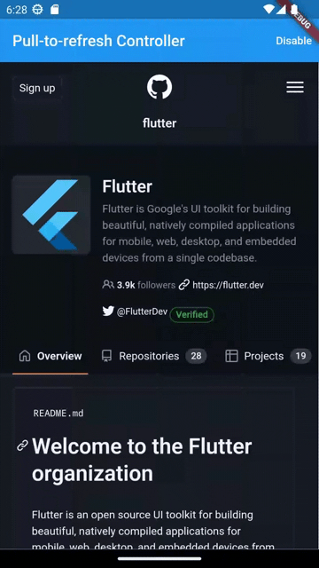
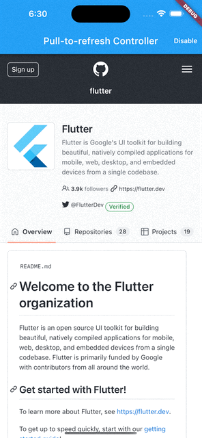

import Tabs from '@theme/Tabs';
import TabItem from '@theme/TabItem';
import config from '../../docusaurus.config';

<head>
  <title>WebView Pull-To-Refresh Controller | {config.title}</title>
</head>

`PullToRefreshController` represents the controller used by the `WebView` to manage the pull-to-refresh feature.

## Basic Usage

Create a new instance of `PullToRefreshController` using your custom `PullToRefreshSettings` and
set the `onRefresh` callback, that is an event called when a pull-to-refresh is detected.
So, put your custom logic inside the callback.

To start using it, assign the instance to the WebView `pullToRefreshController` property.

Use the `endRefreshing()` method to end the refresh operation.

Example:
```dart
import 'dart:async';
import 'package:flutter/foundation.dart';
import 'package:flutter/material.dart';
import 'package:flutter_inappwebview/flutter_inappwebview.dart';

Future main() async {
  WidgetsFlutterBinding.ensureInitialized();

  if (!kIsWeb && defaultTargetPlatform == TargetPlatform.android) {
    await InAppWebViewController.setWebContentsDebuggingEnabled(true);
  }

  runApp(MaterialApp(home: new MyApp()));
}

class MyApp extends StatefulWidget {
  @override
  _MyAppState createState() => new _MyAppState();
}

class _MyAppState extends State<MyApp> {
  final GlobalKey webViewKey = GlobalKey();

  InAppWebViewController? webViewController;
  InAppWebViewSettings settings = InAppWebViewSettings();
  PullToRefreshController? pullToRefreshController;
  PullToRefreshSettings pullToRefreshSettings = PullToRefreshSettings(
    color: Colors.blue,
  );
  bool pullToRefreshEnabled = true;

  @override
  void initState() {
    super.initState();

    pullToRefreshController = kIsWeb
        ? null
        : PullToRefreshController(
            settings: pullToRefreshSettings,
            onRefresh: () async {
              if (defaultTargetPlatform == TargetPlatform.android) {
                webViewController?.reload();
              } else if (defaultTargetPlatform == TargetPlatform.iOS) {
                webViewController?.loadUrl(
                    urlRequest:
                        URLRequest(url: await webViewController?.getUrl()));
              }
            },
          );
  }

  @override
  Widget build(BuildContext context) {
    return Scaffold(
        appBar: AppBar(
          title: const Text('Pull-to-refresh Controller'),
          actions: [
            TextButton(
                onPressed: () async {
                  pullToRefreshEnabled = !pullToRefreshEnabled;
                  await pullToRefreshController
                      ?.setEnabled(pullToRefreshEnabled);
                  setState(() {});
                },
                style: TextButton.styleFrom(foregroundColor: Colors.white),
                child: Text(pullToRefreshEnabled ? 'Disable' : 'Enable'))
          ],
        ),
        body: Column(children: <Widget>[
          Expanded(
              child: InAppWebView(
            key: webViewKey,
            initialUrlRequest:
                URLRequest(url: WebUri("https://github.com/flutter/")),
            initialSettings: settings,
            pullToRefreshController: pullToRefreshController,
            onWebViewCreated: (InAppWebViewController controller) {
              webViewController = controller;
            },
            onLoadStop: (controller, url) {
              pullToRefreshController?.endRefreshing();
            },
            onReceivedError: (controller, request, error) {
              pullToRefreshController?.endRefreshing();
            },
            onProgressChanged: (controller, progress) {
              if (progress == 100) {
                pullToRefreshController?.endRefreshing();
              }
            },
          )),
        ]));
  }
}
```

This is the result:

```mdx-code-block
<Tabs>
  <TabItem value="android" label="Android" default>
```

```mdx-code-block
  </TabItem>
  <TabItem value="ios" label="iOS">
```

```mdx-code-block
  </TabItem>
</Tabs>
```
