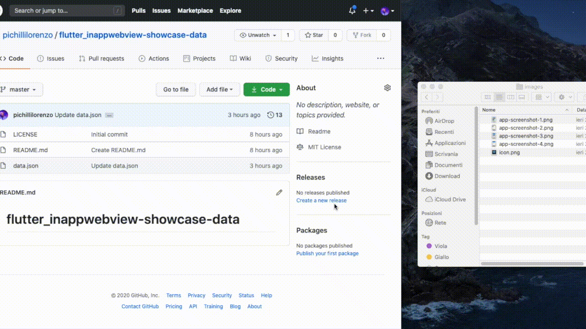

import SubmitAppForm from "./submit-app-form";

# Submit Application

To submit an Application, you need to make a [PULL REQUEST](https://github.com/pichillilorenzo/inappwebview.dev/pulls) to the
[inappwebview.dev](https://github.com/pichillilorenzo/inappwebview.dev) repository, which contains all the data in JSON format inside the
[showcase-data.json](https://github.com/pichillilorenzo/inappwebview.dev/blob/main/src/pages/showcase/showcase-data.json) file.

The following Form below represents an utility that generates the JSON code you need to add to that App list
(the [showcase-data.json](https://github.com/pichillilorenzo/inappwebview.dev/blob/main/src/pages/showcase/showcase-data.json) file) within your
[PULL REQUEST](https://github.com/pichillilorenzo/inappwebview.dev/pulls).

The App Screenshots and the App Icon images **MUST** be uploaded on Github's CDN. To upload images to GitHub's CDN and submit your app, you can follow these steps:

- First, visit the [inappwebview.dev](https://github.com/pichillilorenzo/inappwebview.dev) repository (or any repository on GitHub!) Issues page;
- Create a **New issue**. You'll now see title and description fields;
- Drag-and-drop each image you want upload onto the description field. This will start the uploading process for each image;
- Copy the URL of each image and paste it here (you don't need to submit the issue! Just wait for the uploads to complete);
- After you copied all image URLs, just cancel the **New Issue** you created;
- Generate the JSON code here using the Form below;
- Fork the [inappwebview.dev](https://github.com/pichillilorenzo/inappwebview.dev) repository;
- Append the generated JSON code inside the [showcase-data.json](https://github.com/pichillilorenzo/inappwebview.dev/blob/main/src/pages/showcase/showcase-data.json) file of your Fork and commit your changes;
- Send the **Pull request**.

<SubmitAppForm />
