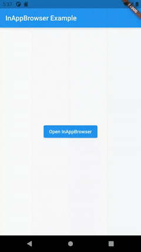

import Tabs from '@theme/Tabs';
import TabItem from '@theme/TabItem';

# InAppBrowser

The `InAppBrowser` class represents a native WebView displayed on top of the Flutter App, so it's not integrated into the Flutter widget tree.

## Basic Usage

You can use the `InAppBrowser.webViewController` property, that is an instance of the `InAppWebViewController` class, to control the `InAppBrowser` instance.

To be able to listen to the `WebView` events, you need to create a class that extends the `InAppBrowser` class in order to override the method callbacks.

Example:
```dart
import 'dart:io';

import 'package:flutter/material.dart';
import 'package:flutter_inappwebview/flutter_inappwebview.dart';

class MyInAppBrowser extends InAppBrowser {
  @override
  Future onBrowserCreated() async {
    print("Browser Created!");
  }

  @override
  Future onLoadStart(url) async {
    print("Started $url");
  }

  @override
  Future onLoadStop(url) async {
    print("Stopped $url");
  }

  @override
  void onLoadError(url, code, message) {
    print("Can't load $url.. Error: $message");
  }

  @override
  void onProgressChanged(progress) {
    print("Progress: $progress");
  }

  @override
  void onExit() {
    print("Browser closed!");
  }
}

Future main() async {
  WidgetsFlutterBinding.ensureInitialized();

  if (Platform.isAndroid) {
    await AndroidInAppWebViewController.setWebContentsDebuggingEnabled(true);
  }

  runApp(
    MaterialApp(
      home: MyApp(),
    ),
  );
}

class MyApp extends StatefulWidget {
  final MyInAppBrowser browser = new MyInAppBrowser();

  @override
  _MyAppState createState() => new _MyAppState();
}

class _MyAppState extends State<MyApp> {
  var options = InAppBrowserClassOptions(
      crossPlatform: InAppBrowserOptions(hideUrlBar: false),
      inAppWebViewGroupOptions: InAppWebViewGroupOptions(
          crossPlatform: InAppWebViewOptions(javaScriptEnabled: true)));

  @override
  Widget build(BuildContext context) {
    return Scaffold(
      appBar: AppBar(
        title: const Text('InAppBrowser Example'),
      ),
      body: Center(
        child: ElevatedButton(
            onPressed: () {
              widget.browser.openUrlRequest(
                  urlRequest: URLRequest(url: Uri.parse("https://flutter.dev")),
                  options: options);
            },
            child: Text("Open InAppBrowser")),
      ),
    );
  }
}
```

This is the result:

```mdx-code-block
<Tabs>
  <TabItem value="android" label="Android" default>
```

```mdx-code-block
  </TabItem>
  <TabItem value="ios" label="iOS">
```

```mdx-code-block
  </TabItem>
</Tabs>
```
